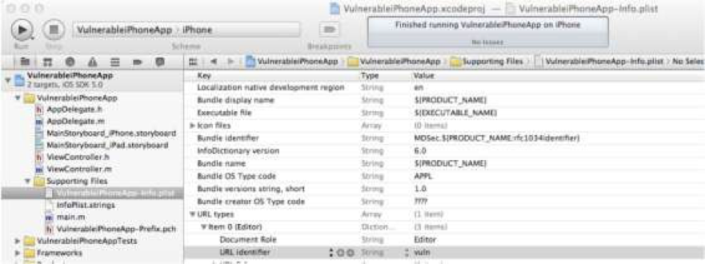

# IOS通用安全编程规范

# 编译保护

源代码需要通过以下的方式进行保护：

* 代码自签名：

代码签名可以用来保证代码的完善并确定代码的开发者。Apple需要所有的iPhone程序在他们运行在开发系统或者上传到apple发布的时候都需要数字签名。另外apple在发布的时候也会添加自己的数字签名。

* 开启 PIE 功能：

ASLR（Address space layout randomization）是一种针对缓冲区溢出的安全保护技术，对堆、栈、共享库映射等线性区布局的随机化。IOS4.3开始在预装的iOS应用中部分开启ASLR功能，使客户端IPA仅支持IOS4.3+并加入PIE Flag，能增加攻击者预测目的地址的难度，防止攻击者直接定位攻击代码位置，达到阻止溢出攻击的目的。

* 使用 ARC：

ARC（Automatic Reference Counting）是苹果自IOS 5+中推出的新特性，其允许编译器在编译时，自动生成实例的引用计数管理部分代码。从而避免由于开发者的内存管理疏忽而导致内存泄漏。

# 数据存储安全

## 基本原则

* 在软件设计阶段，根据业务功能和需求划分出敏感数据。敏感数据应尽量在服务端进行安全的存储。当然，必须确保网络数据传输的安全性。
* 用户个人的敏感信息必须设置最长的保存时间，一旦超过该时间必须立刻删除。
* 应用程序只能收集或者公开业务和应用必须的用户数据。在设计阶段也必须定义出哪些是必须数据，包括它的敏感度、是否可以被其他程序访问。
* 必须在客户端存储的敏感数据应采用IOS平台提供的加密函数或者权威第三方提供的加密函数，不应该自行开发加密算法或者使用弱加密功能的函数（如Base64），密码、证书等信息可以考虑采用Keychain的方式存储。

## 文件加密级别

应用程序安装后创建一个应用程序的主目录/var/mobile/Applications，并在主目录下生成以下4目标文件：

|        目录        |              描述        |
|       -----       |            -----         |
| ./Application.app | APP 所需资源文件，如图片、可执行文件等；内容被签名且运行时校验 |
| ./Documents       | 固定文件存储目录，数据在 iTunes中同步和备份 |
| ./Library         | 配置文件、缓存数据、cookies等 |
| ./tmp             | 临时文件存储目录 |

IOS数据加密API包含4种加密级别，通过传入参数给NSData或NSFileManager实现不同的加密强度，IOS文件加密级别：


|        加密强度        |              描述        |
|           -----       |            -----         |
|    No Protection  |文件不加密存储  |
|   Complete Protection |文件加密存储，且设备锁定状态不可访问 |
|  Complete Unless Open |文件加密存储，且设备关机状态不可访问 |
|  Complete Until First User Authentication |文件加密存储，需设备解锁后访问 |


实现以上不同的加密级别，需传入以下参数，不同加密级别所需参数：


|                                NSData                           |                       NSFileManager                  |
|                                                    -----        |                           -----                      |
| NSDataWritingFileProtectionNone                                 | NSFileProtectionNone                                 |
| NSDataWritingFileProtectionComplete                             | NSFileProtectionComplete                             |
| NSDataWritingFileProtectionCompleteUnlessOpen                   | NSFileProtectionCompleteUnlessOpen                   |
| NSDataWritingFileProtectionCompleteUntilFirstUserAuthentication | NSFileProtectionCompleteUntilFirstUserAuthentication |

例如：一个应用程序需要存储数据到文件系统，但在锁定状态下不需要访问该文件。可以设置为NSDataWritingFileProtectionComplete或NSFileProtectionComplete属性值，使文件具有“Complete Protection”权限：

```

-(BOOL) getFile
{
NSString *fileURL = @"http://www.mdsec.co.uk/training/wahh-live.pdf"; 
NSURL *url = [NSURL URLWithString:fileURL];
NSData *urlData = [NSData dataWithContentsOfURL:url];
if ( urlData )
{
NSArray *paths = NSSearchPathForDirectoriesInDomains(
                         NSDocumentDirectory, NSUserDomainMask, YES);
NSString *documentsDirectory = [paths objectAtIndex:0];
NSString *filePath = [NSString stringWithFormat:@"%@/%@",
documentsDirectory,@"wahh-live.pdf"];
NSError *error = nil;
[urlData writeToFile:filePath 
options:NSDataWritingFileProtectionComplete error:&error];
return YES;
}
return NO;
}

```
## 文件系统安全

IOS文件系统的交互主要用到NSFileManager和NSFileHandle两个类。其中NSFileManager明确限制只能运用于文件系统中，NSFileHandle则支持SOCKETS、管道等。

在特定的情况下，如果攻击者控制了部分文件名，NSFileManager和NSFileHandle都有可能存在目录遍历的问题。两个类分别实现文件读取的参考代码： 

示例1：

```

- (NSData*) readContents:(NSString*)location
{
NSFileManager *filemgr;
NSData *buffer;
filemgr = [NSFileManager defaultManager]; 
buffer = [filemgr contentsAtPath:location]; 
return buffer;
}
```

示例2：

```

- (NSData*) readContentsFH:(NSString*)location
{
NSFileHandle *file; 
NSData *buffer;
file = [NSFileHandle fileHandleForReadingAtPath:location];
buffer = [file readDataToEndOfFile];
 [file closeFile];
return buffer;
}

```

以上的代码中程序员没有事先对位置字符串作处理，导致了目录遍历漏洞。可以利用常见的遍历字符串“../../”访问应用程序敏感文件：

```

NSString *fname = @"../Documents/secret.txt";
NSString *sourcePath = [[NSString alloc] initWithFormat:@"%@/%@",
                                [[NSBundle mainBundle] resourcePath], fname];
NSLog(@"####### PATH = %@", sourcePath);
NSString *contents = [[NSString alloc] initWithData:[fm readContentsFH:sourcePath]
encoding:NSUTF8StringEncoding]; 
NSLog(@"####### File contents: %@", contents);

```

变量fname受用户控制，导致攻击者可以越过当前目录访问Documents目录。开发人员需严格审核用户可控变量的合法性。

```

2012-02-11	15:58:18.029 	VulnerableiPhoneApp[3291:707]	#######	PATH=
/var/mobile/Applications/E84D97BB-79E7-4603-93D3-09A88CB4FA71/VulnerableiPhoneApp.app/../Documents/secret.txt
2012-02-11 15:58:18.040 VulnerableiPhoneApp[3291:707] ####### File contents:
Password=abc123

```

文件操作的过程中，混淆了Objective-C和C语言也可能产生风险。在NSString对象中，Objective-C不会用空字节作为字符串结束标志。如果一个NSString对象作为一个文件路径可受用户控制，后面的文件操作过程采用C语言编写，可能导致攻击者提前结束字符串。
例如下面的代码：

```

NSString *fname = @"../Documents/secret.txt\0";
NSString *sourcePath = [[NSString alloc] initWithFormat:@"%@/%@.jpg", 
                          [[NSBundle mainBundle] resourcePath], fname];
char line[1024];
FILE *fp = fopen([sourcePath UTF8String], "r");
fread(line, sizeof(line), 1024, fp);
NSString *contents = [[NSString alloc] initWithCString:line];
fclose(fp);

```

上面的例子中，开发者希望字符串提供一个访问 JPG 文件的路径，并且试图通过初始化sourcePath变量限制其扩展名。但是，fname变量转换后的空字节可能导致字符串提前结束，使攻击者访问任何文件。

## IOS Keychain

IOS Keychain是一个加密容器，用来存储敏感数据。每个应用程序都有一个独立的Keychain存储，相对NSUserDefaults、文件保存等方式，Keychain更为安全。Keychain里保存的信息不会因App被删除而丢失，在用户重新安装App后依然有效。

与文件系统中的文件类似，可以通过设置数据保护API的不同参数给予IOS Keychain不同的加密级别。

|                           属性值                  |                     描述                |
|                            -----                 |                      -----              |
| kSecAttrAccessibleAlways                         | Keychain 始终可访问                       |
| kSecAttrAccessibleWhenUnlocked                   | Keychain 解锁状态下可访问                 |
| kSecAttrAccessibleAfterFirstUnlock               | Keychain 系统重启后第一次介绍可访问         |
| kSecAttrAccessibleAlwaysThisDeviceOnly           | Keychain 始终可访问，不可移植              |
| kSecAttrAccessibleWhenUnlockedThisDeviceOnly     | Keychain 解锁状态下可访问，不可移植         |
| kSecAttrAccessibleAfterFirstUnlockThisDeviceOnly | Keychain 系统重启后第一次介绍可访问，不可移植 |

SecItemAdd可以增加Keychain条目，所有Keychain目录创建的时候默认的加密级别是kSecAttrAccessibleAlways。

```

<?xml version="1.0" encoding="UTF-8"?>
<!DOCTYPE plist PUBLIC "-//Apple//DTD PLIST 1.0//EN”
          "http://www.apple.com/DTDs/PropertyList-1.0.dtd">
<plist version="1.0">
<dict>
<key>application-identifier</key>
<string>my.company.VulnerableiPhoneApp</string>
<key>get-task-allow</key>
<true/>
<key>keychain-access-group</key>
<array>
<string>my.company.VulnerableiPhoneApp</string>
</array>
</dict>
</plist>

```

# 敏感信息安全

## 硬编码问题

数据库链接字符串、用户名密码等不宜在程序中写死，而应采用配置文件来存储。XML是自描述的、通用的文件结构，能够很好的解决硬编码问题，软化代码。同时需要参考数据 存储安全保护配置文件。

## SQL注入

IOS应用程序SQL注入问题的解决思路与其他应用程序相同。以参数化查询的方式替代字符串拼接，可以有效的解决该问题。

参数化查询参考代码：

```

const char *sql = "SELECT username FROM users where uid = ?"; sqlite3_prepare_v2(
db, sql , -1, &selectUid , NULL); sqlite3_bind_int(selectUid , 1, uid);
int status = sqlite3_step(selectUid);

```

## 跨站点脚本攻击

跨站点脚本攻击通常发生于没有任何过滤就把输入填充到一个UIWebView中，这在WEB视图调用一个用户可控的Objective-C变量时经常发生。例如：一个名为username的Objective-C变量加入到UIWebView的DOM中：

```

NSString *javascript = [[NSString alloc] initWithFormat:@"var myvar=\"%@\";", username];
[mywebView stringByEvaluatingJavaScriptFromString:javascript];
[mywebView loadRequest:[NSURLRequest requestWithURL:[NSURL fileURLWithPath:
[[NSBundle mainBundle] pathForResource:@"index"ofType:@"html"]isDirectory:NO]]];

```

username被增加到一个代表JavaScript的NSString对象中，该对象随后被stringByEvaluatingJavaScriptFromString方法添加进WEB视图的DOM树里。UIWebView直接执行JavaScript触发了跨站点脚本攻击，于此同时变量也被存储在本地的HTML文档里：

```

<html>
<p>
Cross-Site Scripting in UIWebView:
</p>
<P>
This is an example of XSS:
<script>document.write(myvar);</script>
</p>
</html>

```

与传统的跨站点脚本攻击类似，IOS应用程序防御跨站点脚本攻击的主要手段就是严格过滤所有应用程序的输入，并且输出时也需经过合适的编码处理。

# 数据传输安全

## 网络数据传输

IOS应用经常需要与在线的WEB应用程序或者是基于RPC机制的WEB技术交互。这些交互通常使用NSURLConnection类来完成。这个类包含一个NSURLRequest对象，实现HTTP和HTTPS连接。该API使用默认的SSL算法进行安全连接，然而却不能提供足够的粒度供开发者进行选择。
不同版本的SDK之间传输协议有所不同，见下表。

|     SDK版本  |              协议        |   “弱”加密套接字 | 总加密套接字 |
|       ----- |            -----         |     -----      |  ------    |
|     4.3     |           TLS 1.0        |       5        |     29     |
|     5.0     |           TLS 1.2        |       0        |     37     |
|     5.1     |           TLS 1.2        |       0        |     37     |


上表突出了随着SDK版本的更新，加密套接字也随着改进。

以下为简单的本地HTTPS连接示例代码：

```

@ implementation insecuressl
int main(int argc, const char* argv[])
{
NSString *myURL=@"https://localhost/test";
NSURLRequest *theRequest = [NSURLRequest requestWithURL:
[NSURL URL WithString:myURL]];
NSURLResponse *resp = nil; NSError *err = nil;
NSData *response = [NSURLConnection sendSynchronousRequest:
theRequest returningResponse: &resp error: &err];
NSString * theString = [[NSString alloc] initWithData:
response encoding:NSUTF8StringEncoding];
[resp release];
[err release];
return 0;
}

```

使用SDK 5.0、5.1或4.3编译以上程序，并在运行时监听数据包，可以查看不同的结果。

IOS 4.3 SDK协商中，以下的加密套接字是不严密的，不建议采用：

```

λ	TLS_RSA_WITH_DES_CBC_SHA
λ	TLS_RSA_EXPORT_WITH_RC4_MD5
λ	TLS_RSA_EXPORT_WITH_DES40_CBC_SHA
λ	TLS_DHE_RSA_WITH_DES_CBC_SHA
λ	TLS_DHE_RSA_EXPORT_EITH_DES40_CBC_SHA

```

为了防止预防中间人攻击，必须禁止IOS应用程序使用自签名证书。NSURLRequest类默认阻止自签名证书并抛出NSURLErrorDomain异常。然而开发者重写代码以接受自签名证书的情况时有发生，频繁可以见自签名的证书部署在预生产环境中。在请求域中使用allowsAnyHTTPSCertificateForHost方法可以关闭证书验证，以下为简单实现代码：

```

#import "loadURL.h"
@interface NSURLRequest (DummyInterface)
+ (BOOL) allowsAnyHTTPSCertificateForHost:(NSString*)host;
+ (void) setAllowsAnyHTTPSCertificate:(BOOL)allow forHost:(NSString*)host;
@end
@implementation loadURL
- (void) run
{
NSURL *myURL = [NSURL URLWithString:@"https://localhost/test"];
NSMutableURLRequest *theRequest = [NSMutableURLRequest requestWithURL:
myURLcachePolicy:NSURLRequestReloadIgnoringCacheData timeoutInterval:60.0]; 
[NSURLRequest setAllowsAnyHTTPSCertificate:YES forHost:[myURL host]];
[[NSURLConnection alloc] initWithRequest:theRequest delegate:self];
}
@end

```

在应用程序的产品代码中使用私有方法allowsAnyHTTPSCertificateForHost会被苹果商城拒绝上架，另外一种常见的绕过SSL验证的方法是使用ontinueWithoutCredentialForAuth- enticationChallenge选择器，执行NSURLConnection委托类中的didReceiveAuthenticationChallenge 方法，示例代码如下：

```

- (void)connection:(NSURLConnection *)
connection didReceiveAuthenticationChallenge:(NSURLAuthenticationChallenge *)challenge{
if ([challenge.protectionSpace.authenticationMethod isEqualToString:
NSURLAuthe nticationMethodServerTrust])
{
[challenge.sender useCredential:
[NSURLCredential credentialForTrust:challenge.protectionSpace.serverTrust]
forAuthenticationChallenge:challenge];
[challenge.sender continueWithoutCredentialForAuthenticationChallenge:challenge];
return;
}
     }
     
```

CFNetwork.framework提供了一个替代的API来实现SSL，该框架使开发者可以更好的控制并定制SSL会话。类似于NSURLRequest，开发者削弱SSL配置的情况并不少见。CF Network提供了更大粒度的控制，允许应用程序接收过期的证书或根，允许任何根甚至在证书链中不采取任何验证措施。

以下代码为某真实应用中使用了onSocket委托方法：

```

- (void)onSocket:(AsyncSocket *)sock didConnectToHost:(NSString *)host port: (UInt16)port{
NSMutableDictionary *settings = [[NSMutableDictionary alloc] initWithCapacity:3];
[settings setObject:[NSNumber numberWithBool:YES] 
forKey:(NSString *)kCFStreamSSLAllowsExpiredCertificates];
[settings setObject:[NSNumber numberWithBool:YES] 
forKey:(NSString *)kCFStreamSSLAllowsAnyRoot];
[settings setObject:[NSNumber numberWithBool:NO]
forKey:(NSString *)kCFStreamSSLValidatesCertificateChain];
[sock startTLS:settings];}

```

然而当使用CFNetwork.framework时，没有提供再次修改加密套接字的明确方法，SDK的默认密钥已经处于被使用状态。
总之，在开发IOS应用程序时，应尽可能的使用最新的SDK，并且以安全的方式在默认模式下开发。

## IPC安全

很多时候我们需要APP支持进程间交互，方便调用其它应用程序以及进程间的数据传输。例如，我们需要从Safari中调用其他应用程序，或者实现APP之间的数据交互。有两个API可以实现protocol handlers： application:openURL 以及 application:handleOpenURL （后者已废除）。使用openURL的优势在于它支持验证实例化URL请求的来源。

通常增加一个URL类型到应用程序的plist文件中完成自定义URL scheme的注册。下图的VulnerableiPhoneApp工程中注册了一个名为“vuln”的protovol handler。



在XCode中注册一个IPC protocol handler的代码可以通过应用程序委派的handleOpenURL或者openURL方法实现。下面的代码简单实现了利用请求的URL显示一个alertView的功能：

```

- (BOOL)application:(UIApplication *)application handleOpenURL:(NSURL *)url {
UIAlertView *alertView;
NSString *text = [[url host] stringByReplacingPercentEscapesUsingEncoding:
NSUTF8StringEncoding]; 
alertView = [[UIAlertView alloc] initWithTitle:@"Text" message:
text delegate:nil cancelButtonTitle:@"OK" otherButtonTitles:nil];
[alertView show];
return YES;
}

```

测试某应用程序时发现一个可以实现配置更改的自定义URL。设计之初只是为了方便开发者，但却被固化到发行的代码中。例如下面handleOpenURL方法的实现：

```

- (BOOL)application:(UIApplication *)application handleOpenURL:(NSURL *)url {
if (!url) { return NO; }
NSString *method = [[url host] 
stringByReplacingPercentEscapesUsingEncoding:NSUTF8StringEncoding];
if([method isEqualToString:@"setHomeURL"])
{
Settings *s = [[Settings alloc] init];
NSString *querystr =
[[url query] stringByReplacingPercentEscapesUsingEncoding:
NSUTF8StringEncoding];
 NSArray *param = [querystr componentsSeparatedByString:@"="];
NSString *value = [param objectAtIndex:1]; [s setHomeURL:value];
}
return YES;
 }
 
```

这段代码中，自定义的URL handler负责处理应用程序开启后默认URL的更新。这个方法接收一个NSURL对象，这个对象随后被解析。 如果传入的host是一个setHomeURL，这个方法会调用Setting对象的setHomeURL方法，并且传入URL第一个参数的值。

Setting对象的setHomeURL方法配置了应用程序的优先权，实现代码如下：

```

@implementation Settings
- (void) setHomeURL:(NSString*)url{
NSUserDefaults *prefs = [NSUserDefaults standardUserDefaults];
[prefs setObject:url forKey:@"homeURL"];
[prefs synchronize];
}

```

攻击者可以利用一段恶意的iframe重新配置应用程序的默认加载页面：

```

<iframe src=”vuln://setHomeURL?url=http://mdattacker.net”></iframe>

```

一个可行的解决方法是让更新API调用openURL，并且提供发起URL请求的APP的信息。下面的代码可以用来确认一个URL是否由应用程序本身发起：

```

- (BOOL)application:(UIApplication *)application openURL:
(NSURL *)url sourceApplication:(NSString *)sourceApplication annotation:
(id)annotation {
NSString* myBid = [[NSBundle mainBundle] bundleIdentifier];
if ([sourceApplication isEqualToString:myBid]){
return NO;
} else if (!url) {
   return NO; 
} 
NSString *method = [[url host] stringByReplacingPercentEscapesUsingEncoding:
NSUTF8StringEncoding]; 
if([method isEqualToString:@"setHomeURL"]){
Settings *s = [[Settings alloc] init];
NSString *querystr = 
[[url query] stringByReplacingPercentEscapesUsingEncoding:
NSUTF8StringEncoding]; 
NSArray *param = [querystr componentsSeparatedByString:@"="];
NSString *value = [param objectAtIndex:1];
[s setHomeURL:value];
}
return YES;

```

也可能开发者希望确保URL只能被其他应用程序调用。例如Safari，通过以下的代码来实现：

```

- (BOOL)application:(UIApplication *)application openURL:
(NSURL *)url sourceApplication:(NSString *)sourceApplication annotation:
(id)annotation {
NSString *SafariPath = @"/Applications/MobileSafari.app";
NSBundle *bundle = [NSBundle bundleWithPath:SafariPath];
if ([sourceApplication isEqualToString:[bundle bundleIdentifier]]){
return No;
}

```

Skype在IOS平台的应用程序曾经存在该漏洞。“skype” protocol handler可以实例化来电和聊天功能。攻击者利用一段恶意的iframe，在无需授权的情况下拨出电话。利用MobileSafari启动Skype应用程序可以触发攻击代码：

```

<iframe src=”skype://123456789?call"></iframe>

```

Skype解决这个问题的方法是弹出一个UIView，询问用户接受或者拒绝这个来电。

一个简单的识别URL有效性的方法是，获取解密后的应用程序并检查协议字符串。Facebook 中的样例（截取自558个URL）：

```

bash-3.2# strings Facebook.app/Facebook | grep "://" | grep -v "http" 
fb://upload/actions/newalbum
fb://root 
fb://birthdays
fb://messaging 
fb://notifications
fb://requests 
fb://publish
fb://publish/profile/(gatePublishWithUID:)
fb://oldpublish
fb://oldpublish/profile/(initWithUID:) 
fb://publish/post/(initWithPostId:) 
fb://publish/photo/(initWithUID:)/(aid:)/(pid:) 
fb://publish/mailbox/(initWithFolder:)/(tid:) 
fb://publish/privacy
fb://place/create 
fb://compose
fb://compose/profile/(initWithUID:)

```

protocol handlers帮助开发者轻松实现进程内部的通信。但是开发者需要严格的验证进入应用程序的来源和数据的可靠性，避免protocol handlers访问敏感数据以及危险的功能。

# 异常处理

## 处理异常

* Object-C语言的异常处理符号和C++、JAVA相似。再加上使用NSException，NSError或者自定义的类，你可以在你的应用程序里添加强大的错误处理机制。
* 异常处理机制是由这个四个关键字支持的：@try，@catch，@thorw，@finally。当代码有可能出现异常时，我们把他放到@try语句块中。@catch()块包含了处理@try块里的抛出的异常的逻辑。无论异常是否发生，@finally块里面的语句都会执行。 如果直接使用@throw块来抛出异常，这个异常本质上是一个OC的对象。咱们可以使用NSException对象，但是不局限于他们。
* 下面是一个典型的异常处理块的例子：

```

Cup *cup = [[Cup alloc] init];
@try { [cup fill];
} @catch (NSException *exception) {
NSLog(@"main: Caught %@: %@", [exception name], [exception reason]);
} @finally {
[cup release];
}

```

## 抛出异常

* 为了掷出一个异常，我们必须实例化一个对象，当然这个对象要包含相关的信息， 比如异常的名字和为什么要掷出他。

```

NSException *exception = [NSException exceptionWithName:@"HotTeaException"
reason:@"The tea is too hot" userInfo:nil];
@throw exception;

```

* 和@catch()块相反，你可以使用@throw再次掷出一个被抓到的异常。你也可以继承NSEception，来实现特殊类型的异常，比如文件系统的异常或者交互异常。
* 注意：不用仅限于掷出NSException对象。你可以掷出任何一个OC对象作为一场对象。NSException类提供的方法可以帮助你处理异常，但是如果你愿意你可以实现你自己的。
## 高端处理异常

为了捕获一个使用@try块掷出的异常，你可以在@try后面使用多个@catch()块。@catch块可以由最特殊的到最普遍的排序。

```

@try {
...
} @catch (CustomException *ce) { //1
...
} @catch (NSException *ne) { //2
// Perform processing necessary at this level. ...
// Rethrow the exception so that it's handled at a higher level. @throw;
} @catch (id ue) { //3
...
} @finally { //4
// Perform processing necessary whether an exception occurred or not. ...
}

```

# 日志审计
IOS客户端应用软件日志主要为记录软件运行时的异常事件。用户重要操作等行为记录应放在服务端审计。避免开发者编写NSLog到发布的应用程序中最简单的方法就是重定义它。 写一个虚拟预处理器的宏，例如：“#define NSLog(…)”。

为方便调试软件，并保证业务层的软件运行安全，可以把运行日志输出到本地文件中进 行保存，应注意以下几点。

* 使用时间戳：必须明确的把时间戳包含在日志文件内，时间戳可以形成一条清晰的事件时间线。
* 记录每个重要行为：确保在某种重要行为发生时有相应的记录，捕获系统异常信息。
* 保护日志文件：控制其他应用程序对日志的访问权限。

# 增强的安全

## 内存污染问题

* 格式化字符串
格式化字符串漏洞是一类内存污染问题。它的产生是由于滥用Objective-C中需要接受 格式说明符的方法。易受影响的Objective-C方法：

```

NSLog
[NSString stringWithFormat] 
[NSString stringByAppendingFormat] 
[NSString initWithFormat] 
[NSMutableString appendFormat] 
[NSAlert alertWithMessageText] 
[NSAlert informativeTextWithFormat] 
[NSException format] 
[NSMutableString appendFormat] 
[NSPredicate predicateWithFormat]

```

攻击者如果能够控制有关函数的部分或者全部的格式说明符，就能触发格式化字符串漏洞。以下是一段存在漏洞的代码：

```

NSString *myURL=@"http://10.0.2.1/test";
NSURLRequest *theRequest = [NSURLRequest requestWithURL:
[NSURL URLWithString:myURL]];
NSURLResponse *resp = nil; NSError *err = nil;
NSData *response = [NSURLConnection sendSynchronousRequest: 
theRequest returningResponse:&resp error: &err];
NSString * theString = [[NSString alloc] initWithData:response encoding:
NSASCIIStringEncoding];
NSLog(theString);

```

上面的代码构造一个Request请求，WEB服务器IP为10.0.2.1。Response存储在一个NSData对象中，并被转为一个NSString对象记录在NSLog中。NSLog封装了NSLogv方法，包括以下几个参数：

```

void NSLogv ( NSString *format, va_list args);

```

然而，在这个实例中开发人员只提供了一个单独的参数，允许攻击者指定可被记录的参数类型。
在调试器中运行这段代码，可以看到仅使用一段简单的HTTP服务器Response来触发格式化字符串漏洞：

```

bash-3.2# nc -lvp 80
listening on [any] 80 ...
10.0.2.2: inverse host lookup failed: Unknown host 
connect to [10.0.2.1] from (UNKNOWN) [10.0.2.2] 52141
GET /test HTTP/1.1
Host: 10.0.2.1
User-Agent: fmtstrtest (unknown version) CFNetwork/548.0.4 Darwin/11.0.0
Accept: */*
Accept-Language: en-us Accept-Encoding: gzip, deflate Connection: keep-alive
HTTP/1.1 200 OK
Content-Type: text/html; charset=utf-8
Content-Length: 16
aaaa%x%x%x%x%x%x

```

HTTP响应头部被记录到NSLog中触发了格式化字符串漏洞，导致栈内存dump到控制台日志中：

```

(gdb) r
Starting program: /private/var/root/fmtstrtest
objc[8008]: Object 0x11f0b0 of class NSURL autoreleased with no pool in place -just leaking - break on objc_autoreleaseNoPool() to debug
objc[8008]: Object 0x11e310 of class NSURLRequest autoreleased with no pool in place - just leaking - break on objc_autoreleaseNoPool() to debug
objc[8008]: Object 0x11f540 of class NSThread autoreleased with no pool in place
- just leaking - break on objc_autoreleaseNoPool() to debug
2012-02-29 17:02:36.304 fmtstrtest[8008:303] aaaa124a600782fe5b84411f0b00
Program exited normally. (gdb)

```

传统的格式化字符串漏洞可以利用“%n”完成，它允许攻击者在从栈中读取任意的内存地址并写入。但是这个格式说明符在Objective-C中并不适用。IOS格式化字符串漏洞可以通 过“%@”实现，它定义了一个Objective-C对象。因此，允许任意函数指针被调用。

下面的试例简单的把参数从argv[1]传 NSLog中：

```

int main(int argc, const char* argv[])
{
NSAutoreleasePool *pool =[[NSAutoreleasePool alloc] init]; 
NSString *n = [[NSString alloc] initWithCString:argv[1]]; 
NSLog(n);
[pool drain];
return 0;
}
向栈内存中压入大量的数据，可以看到取值过程中“%@”说明符如何产生问题：
(gdb) r 
bbbbbbbbbbbbbbbb%x%x%x%x%x%x%x%%x%x%x%x%x%x%x%%x%x%x%x%x%x
%x%%x%x%x%x%x%x%x%%x%x%
x%x%x%x%x%%x%x%x%x%x%x%x%%x%x%x%x%x%x%x%%x%x%x%x%x%x%x%
%x%x%x%x%x%x%x%x%x%x%@
Starting program: /private/var/root/fmtstrtest
bbbbbbbbbbbbbbbb%x%x%x%x%x%x%x%%x%x%x%x%x%x%x%%x%x%x%x%x%x
%x%%x%x%x%x%x%x%x%%x%x%
x%x%x%x%x%%x%x%x%x%x%x%x%%x%x%x%x%x%x%x%%x%x%x%x%x%x%x%
%x%x%x%x%x%x%x%x%x%x%@
Program received signal EXC_BAD_ACCESS, Could not access memory.
Reason: KERN_INVALID_ADDRESS at address: 0x62626262
0x320f8fb6 in ?? ()
(gdb)

```

幸好在大多数情况下 Objective-C用堆来存储对象，因此攻击并不容易。

* use-after-free

对象被释放后引用仍然存在，则可能导致对象的use-after-free漏洞。如果释放的内存被 重用，并且攻击者能够控制重用的内存，某些情况下就可能导致任意代码执行。

例如下面的代码：

```

MDSec *mdsec = [[MDSec alloc] init];
[mdsec release];
[mdsec echo: @"MDSec!"];

```

MDSec类第一次被创建之后释放，但是echo方法调用的是释放之前的指针。这种情况下的攻击并不容易，因为内存并没有被污染。下面的样例中用户可控的数据导致堆喷射：

```

MDSec *mdsec = [[MDSec alloc] init]; 
[mdsec release];
for(int i=0; i<=50000; i++) {
char *buf = strdup(argv[1]);
}
[mdsec echo: @"MDSec!"];

```

当执行echo方法时会导致非法访问，因为重用了堆内存中已被释放的对象实例。

```

(gdb) r AAAA
Starting program: /private/var/root/objuse AAAA
Program received signal EXC_BAD_ACCESS, Could not access memory. 
Reason: KERN_INVALID_ADDRESS at address: 0x41414149
0x320f8fbc in ?? ()
(gdb)

```

IOS 5中介绍了自动引用计数（Automatic Reference Counting，ARC），把内存管理的责任从开发者转移到编译器中。应用程序如果采用ARC可以极大地降低use-after-free问题， 开发者不需要再承担释放和保持对象的风险。

## 后台处理

UIApplication委派applicationDidEnterBackground方法可以用来检查后台推送并且修 改显示。例如，如果存在包含敏感信息的特殊字符，应用程序可以用“hidden”属性隐藏它，对应的，当应用程序重启时可以通过applicationDidBecomeActive方法还原隐藏信息：

```

- (void)applicationDidBecomeActive:(UIApplication *)application {
viewController.creditcardNumber.hidden = NO;
}

```


