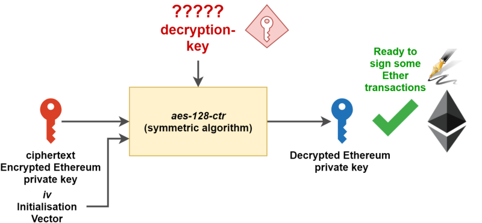
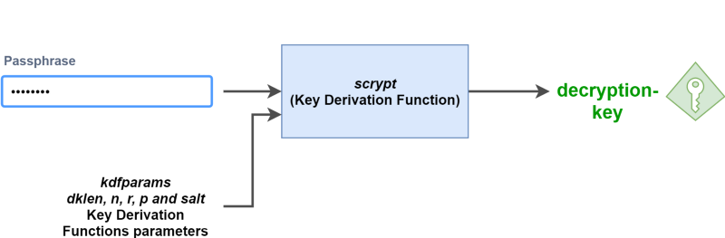
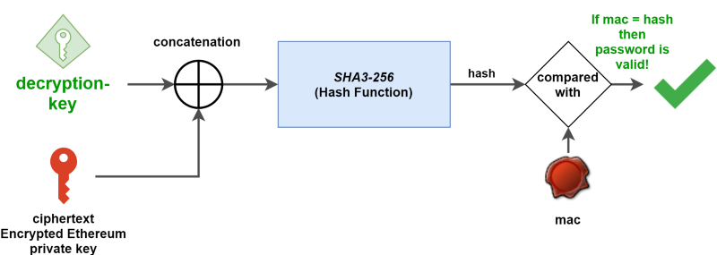
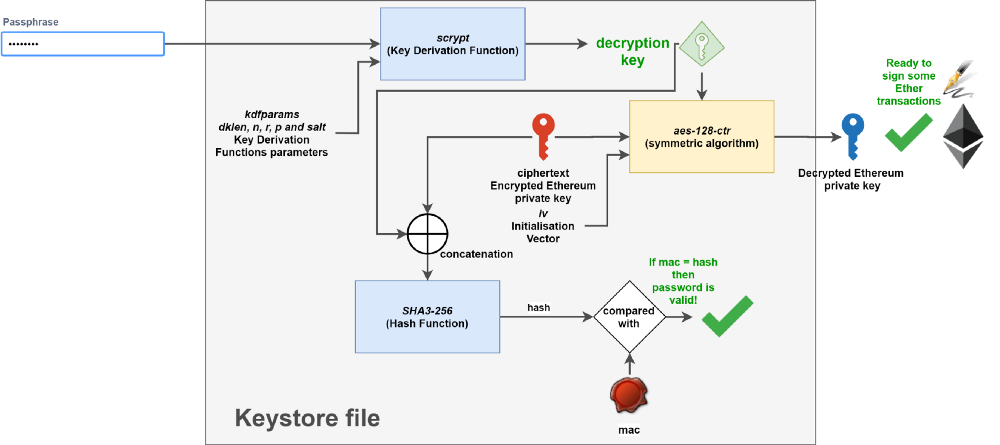

# iBitcome(android)钱包keystore文件创建分析


## 以太坊keystore文件

### 什么是keystore文件？

以太坊的 keystore 文件是你独有的、用于签署交易的以太坊私钥的加密文件。如果你丢失了这个文件，你就丢失了私钥，意味着你失去了签署交易的能力，意味着你的资金被永久的锁定在了你的账户里。

当然，你可以直接把你的以太坊私钥存储在一个加密文件里，但是这样你的私钥容易受到攻击，攻击者简单的读取你的文件、用你的私钥签署交易，把钱转到他们的账户中。你的币会在你意识到发生什么了之前的短时间内丢失。

这就是以太坊 keystore 文件被创建的原因：它允许你以加密的方式存储密钥。这是安全性（一个攻击者需要 keystore 文件和你的密码才能盗取你的资金）和可用性（你只需要keystore文件和密码就能用你的钱了）两者之间完美的权衡。

为了让你发送一些以太币，大多数的以太坊客户端会让你输入密码（与创建账户时密码相同）以解密你的以太坊私钥。一旦解密，客户端程序就得到私钥签署交易，允许你移动资金。

### Keystore文件是什么样子的？

如果你打开一个你的账户文件，它看起来像这样:

```

{
	"address": "7c3fd49ae91c7d27e5a188b46d6fd737bb053672",
	"crypto": {
		"cipher": "aes-128-ctr",
		"ciphertext": "6f52c9a535fff54a6b52aa0bbaba1970970087790c0354eb3690e193cdcb7491",
		"cipherparams": {
			"iv": "17b4943b6e6386006efc3af344d5062d"
		},
		"kdf": "scrypt",
		"kdfparams": {
			"dklen": 32,
			"n": 262144,
			"p": 1,
			"r": 8,
			"salt": "b4fe31d98b8211128e4e4429be586bd5b46309bc210b120846623ac421072493"
		},
		"mac": "5df02da03b80d284c71dc803f5a8a328993f4218ff069fb9f23b0d3943a17bf6"
	},
	"id": "59f15559-a151-4006-be58-0c46918815e5",
	"version": 3
}

```

### 让我们深入理解一下

如果你看这个 keystore 文件的结构，你会看到大部分内容都是在“crypto”中的：

```

	"crypto": {
		"cipher": "aes-128-ctr",
		"ciphertext": "6f52c9a535fff54a6b52aa0bbaba1970970087790c0354eb3690e193cdcb7491",
		"cipherparams": {
			"iv": "17b4943b6e6386006efc3af344d5062d"
		},
		"kdf": "scrypt",
		"kdfparams": {
			"dklen": 32,
			"n": 262144,
			"p": 1,
			"r": 8,
			"salt": "b4fe31d98b8211128e4e4429be586bd5b46309bc210b120846623ac421072493"
		},
		"mac": "5df02da03b80d284c71dc803f5a8a328993f4218ff069fb9f23b0d3943a17bf6"
	}
    
```
这包括：

- cipher：对称 AES 算法的名称;
- cipherparams：上述 cipher 算法需要的参数;
- ciphertext：你的以太坊私钥使用上述 cipher 算法进行加密;
- kdf：密钥生成函数，用于让你用密码加密 keystore 文件;
- kdfparams：上述 kdf 算法需要的参数;
- mac：用于验证密码的代码。

让我们看看他们是如何协同工作的，如何在你的密码下保护 keystore 文件。

#### 加密你的私钥

就像之前提到的，一个以太坊账户就是用于加密签署交易的一个私钥 —公钥对。为了确保你的私钥没有在文件中明文存储（即任何人只要能得到这个文件就能读），使用强对称算法（cipher）对其加密至关重要。

这些对称算法使用密钥来加密数据。加密后的数据可以使用相同的方法和同样的密钥来解密，因此算法命名为对称算法。在本文中，我们称这个对称密钥为解密密钥，因为它将用于对我们的以太坊私钥进行解密。

以下是 cipher，cipherparams 和 ciphertext 对应的概念：

- Cipher 是用于加密以太坊私钥的对称加密算法。此处cipher用的是 aes-128-ctr 加密模式。
- Cipherparams 是 aes-128-ctr 加密算法需要的参数。在这里，用到的唯一的参数 iv，是aes-128-ctr加密算法需要的初始化向量。
- Ciphertext 密文是 aes-128-ctr 函数的加密输入。

所以，在这里，你已经有了进行解密以太坊私钥计算所需要的一切...等等。你需要首先取回你的解密密钥。



-**ciphertex 密文的对称解密**- 

#### 用你的密码来保护它

要确保解锁你的账户很容易，你不需要记住你的每一个又长又非用户友好型的用于解密 ciphertext 密文解密密钥。相反，以太坊开发者选择了基于密码的保护，也就是说你只需要输入密码就能拿回解密密钥。

为了能做到这一点，以太坊用了一个密钥生成函数，输入密码和一系列参数就能计算解密密钥。

这就是 kdf 和 kdfparams 的用途：

- kdf 是一个密钥生成函数，根据你的密码计算（或者取回）解密密钥。在这里，kdf 用的是scrypt算法。
- kdfparams 是scrypt函数需要的参数。在这里，简单来说，dklen、n、r、p 和 salt 是 kdf 函数的参数。更多关于 scrypt 函数的信息可以在这里找到。

在这里，用 kdfparams 参数对 scrypt 函数进行调整，反馈到我们的密码中，你就会得到解密密钥也就是密钥生成函数的输出。



-**用密码生成密钥**- 

#### 确保你的密码是对的

我们描述了用密码和 keystore 文件生成以太坊私钥所需要的所有东西。然而，如果解锁账户的密码错误会发生什么？

根据迄今为止我们所看到的，所有操作（密码派生和解密）都会成功，但是最终计算的以太坊私钥不是正确的，这首先违背了密钥文件的使用初衷！

我们要保证输入解锁账户的密码是正确的，和最初创建 keystore 文件时一样（回想一下 geth 下创建新账户时两次输入的密码）。

这就是 keystore 文件中 mac 值起作用的地方。在密钥生成函数执行之后，它的输出（解密密钥）和 ciphertext 密文就被处理【注1】，并且和 mac（就像一种认可的印章）作比较。如果结果和 mac 相同，那么密码就是正确的，并且解密就可以开始了。

【注1】这里有点简略了。在和 mac 进行比较之前，解密密钥（左起第二字节开始的16字节）要和 ciphertext 密文连接在一起，并进行哈希散列（用SHA3-256的方法）。 更多信息请访问[这里](https://github.com/hashcat/hashcat/issues/1228)。



#### 把所有的都放到一起考虑

唷！ 如果你已经做到了这一点，那么恭喜你！ 

让我们回顾一下我们描述的3个函数。

首先，你输入了密码，这个密码作为 kdf 密钥生成函数的输入，来计算解密密钥。然后，刚刚计算出的解密密钥和 ciphertext 密文连接并进行处理，和 mac 比较来确保密码是正确的。最后，通过 cipher 对称函数用解密密钥对 ciphertext 密文解密。

瞧！解密的结果是你的以太坊私钥。 你可以在这里看看整个过程：



就像你从图中可以看到的，整个过程可以看做一个黑盒（不过，图中是个灰盒），你的密码是惟一的输入，你的以太坊私钥是惟一的输出。所需的其他信息都可以在你的以太坊账户创建时生成的keystore文件中获得。

由于这个原因，请确保你的密码足够强（并且无论如何你要记住它！）才能保证即使攻击者偷到了你的keystore文件也不能轻易得到你的私钥。


## keystore文件创建过程分析

在上一个章节熟悉了keystore文件的各个字段含义和生成方式以后，下面我们来看具体的代码上怎么实现的。
为了方便我们从com.winway.bitcome.ui.hom.CreateWalletActivity的 createWallet方法开始分析，里面有一行是

```
String v10 = v.d(v9, this.val$password);
```
这里v9就是生成的ECKeyPair对象转换的私钥String对象，password即是输入的授权密码，继续往下走v.d函数有一行是：

```
arg1 = ObjectMapperFactory.getObjectMapper().writeValueAsString(HDKeystore.createStandard(arg2, arg1));
```
这里调用了com.winway.bitcome.util.hd.HDKeystore的createStandard方法。createStandard方法的入参是反过来的，arg2是授权密码，arg1是私钥String对象。
createStandard方法定义如下：
```

public static HDKeystoreFile createStandard(String arg2, String arg3) {
      return HDKeystore.create(arg2, arg3, 262144, 1);
  }
```
从上面代码可以看到实际调用了HDKeystore.create方法，这里有四个入参数，arg2为收入的授权密码，args3为ECKeyPair转换的私钥String对象，后面两个参数为262144和1，对照上一章节，即可以得出这里的第三个参数为n=262144，第四个参数为p=1。


继续查看create函数，代码如下所示：

```

public static HDKeystoreFile create(String arg7, String arg8, int arg9, int arg10) {
      byte[] v0 = HDKeystore.generateRandomBytes(32);
      byte[] v7 = HDKeystore.generateDerivedScryptKey(arg7.getBytes(Charset.forName("UTF-8")), v0, arg9, 8, arg10, 32);
      byte[] v2 = Arrays.copyOfRange(v7, 0, 16);
      byte[] v3 = HDKeystore.generateRandomBytes(16);
      byte[] v1 = HDKeystore.performCipherOperation(1, v3, v2, Base58Check.base58ToBytes(arg8));
      return HDKeystore.createWalletFile(v1, v3, v0, HDKeystore.generateMac(v7, v1), arg9, arg10);
  }


```

generateRandomBytes函数是生成长度为32的字节数组：
```

static byte[] generateRandomBytes(int arg1) {
      byte[] v1 = new byte[arg1];
      HDKeystore.SECURE_RANDOM.nextBytes(v1);
      return v1;
  }
    
```

这里SECURE_RANDOM为private static SecureRandom SECURE_RANDOM，说明采用了java的安全随机数类，这里是OK的。继续往下看generateDerivedScryptKey函数：

```
byte[] v7 = HDKeystore.generateDerivedScryptKey(arg7.getBytes(Charset.forName("UTF-8")), v0, arg9, 8, arg10, 32);

```

结合上一章节的知识，根据函数名字即可看到这里说调用scrypt函数根据输入的授权密码生成真正的加解密密钥，从上面代码可以看到arg7为授权密码，v0为前面生成的salt，arg9为n即262144，8为scrypt算法的数r，arg10为p即1，32为scrypt算法的参数dklen。generateDerivedScryptKey方法的具体实现如下：

```

private static byte[] generateDerivedScryptKey(byte[] arg0, byte[] arg1, int arg2, int arg3, int arg4, int arg5) {
    try {
        return SCrypt.a(arg0, arg1, arg2, arg3, arg4, arg5);
    }
    catch(GeneralSecurityException v0) {
        throw new CipherException(((Throwable)v0));
    }
}

```

从上面代码可以看到generateDerivedScryptKey方法最终是调用了SCrypt.a方法。这里a方法为lambdaworks库的方法，本次对库函数不做具体的分析。
继续往下分析：

```

byte[] v2 = Arrays.copyOfRange(v7, 0, 16);
 
```
 
这里相当于v2拷贝了v7的0-15字节一共16个字节。

```

byte[] v3 = HDKeystore.generateRandomBytes(16);

```
这里再次调用了generateRandomBytes生成长度为16的字节数组，继续让下看：

```
byte[] v1 = HDKeystore.performCipherOperation(1, v3, v2, Base58Check.base58ToBytes(arg8));
 
```
performCipherOperation方法的定义为：

```

private static byte[] performCipherOperation(int arg3, byte[] arg4, byte[] arg5, byte[] arg6) {
    try {
        IvParameterSpec v0 = new IvParameterSpec(arg4);
        Cipher v4 = Cipher.getInstance("AES/CTR/NoPadding");
        v4.init(arg3, new SecretKeySpec(arg5, "AES"), ((AlgorithmParameterSpec)v0));
        return v4.doFinal(arg6);
    }
    catch(IllegalBlockSizeException v3) {
        return HDKeystore.throwCipherException(((Exception)v3));
    }
    catch(BadPaddingException v3_1) {
        return HDKeystore.throwCipherException(((Exception)v3_1));
    }
    catch(InvalidKeyException v3_2) {
        return HDKeystore.throwCipherException(((Exception)v3_2));
    }
    catch(InvalidAlgorithmParameterException v3_3) {
        return HDKeystore.throwCipherException(((Exception)v3_3));
    }
    catch(NoSuchAlgorithmException v3_4) {
        return HDKeystore.throwCipherException(((Exception)v3_4));
    }
    catch(NoSuchPaddingException v3_5) {
        return HDKeystore.throwCipherException(((Exception)v3_5));
    }
}

```

从上面代码可以看到performCipherOperation方法的第一个参数1即为加密模式，第二个参数v3即为AES加密算法的输入iv向量，第三个参数v3即为AES加密算法的输入key，arg8为最开始输入的ECKeyPair转换的私钥String对象。从分析来看：

- 输入密钥长度为16字节即128位。
- 从填充模式"AES/CTR/NoPadding"可以看到，此AES加密模式位CTR。

从以上两点分析可以得出私钥的加密算法符合上一章节分析的aes-128-ctr加密模式。

继续往下分析：

```

return HDKeystore.createWalletFile(v1, v3, v0, HDKeystore.generateMac(v7, v1), arg9, arg10);
 
```
generateMac方法有两个参数，分别是前面分析的根据输入的授权密码生成的加解密密钥和经过aes-128-ctr加密过后的ECKeyPair转换的私钥String对象。先看generateMac方法的实现：

```
private static byte[] generateMac(byte[] arg3, byte[] arg4) {
    byte[] v2 = new byte[arg4.length + 16];
    System.arraycopy(arg3, 16, v2, 0, 16);
    System.arraycopy(arg4, 0, v2, 16, arg4.length);
    return Hash.sha3(v2);
}
```

继续跟踪可以看到是最终调用了web3j库的sha3算法对输入参数进行加密。
最后跟踪createWalletFile方法，方法具体实现如下：

```
private static HDKeystoreFile createWalletFile(byte[] arg3, byte[] arg4, byte[] arg5, byte[] arg6, int arg7, int arg8) {
    HDKeystoreFile v0 = new HDKeystoreFile();
    v0.setAddress("HDKeystore");
    v0.type = Integer.valueOf(1);
    Crypto v1 = new Crypto();
    v1.setCipher("aes-128-ctr");
    v1.setCiphertext(Numeric.toHexStringNoPrefix(arg3));
    v0.setCrypto(v1);
    CipherParams v3 = new CipherParams();
    v3.setIv(Numeric.toHexStringNoPrefix(arg4));
    v1.setCipherparams(v3);
    v1.setKdf("scrypt");
    ScryptKdfParams v3_1 = new ScryptKdfParams();
    v3_1.setDklen(32);
    v3_1.setN(arg7);
    v3_1.setP(arg8);
    v3_1.setR(8);
    v3_1.setSalt(Numeric.toHexStringNoPrefix(arg5));
    v1.setKdfparams(((KdfParams)v3_1));
    v1.setMac(Numeric.toHexStringNoPrefix(arg6));
    v0.setCrypto(v1);
    v0.setId(UUID.randomUUID().toString());
    v0.setVersion(3);
    return v0;
}

```

从以上代码可以看到，就是根据前面分析将每段代码生成的v1、v3、v0等信息通过set方法存入到HDKeystoreFile对象里面，然后在其他地方通过对象转换为json格式即可。

## 总结

通过追踪代码分析keystore文件对象的整个生成过程，完全符合前面的关于keystore文件安全相关的介绍。说明iBitcome钱包是严格按照keystore文件相关要求来生成的。

## 参考

- [https://medium.com/@julien.m./what-is-an-ethereum-keystore-file-86c8c5917b97](https://medium.com/@julien.m./what-is-an-ethereum-keystore-file-86c8c5917b97)


    


