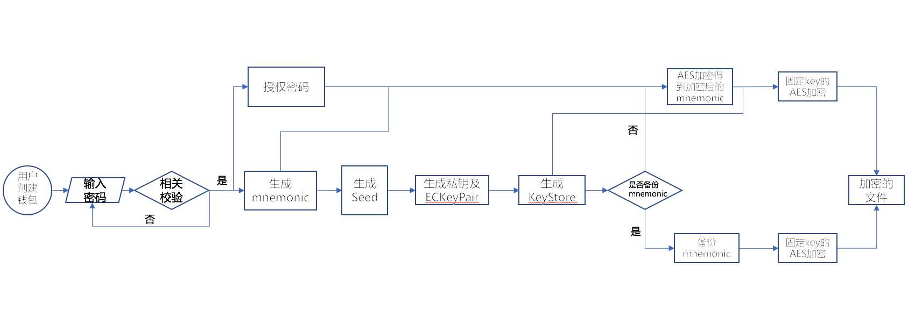
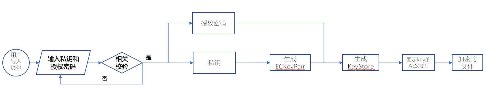

# iBitcome数字钱包(android)安全性分析

## 阅读对象

本文档通过反编译iBitcome数字钱包android app的主要流程来分析钱包android app的安全性。

本文档阅读对象包括iBitcome钱包的架构设计人员、开发人员、安全测试人员以及其他安全相关人员，通过阅读此文档，能够对iBitcome钱包的安全性现状有一个清晰的认识。

## 安全设计

iBitcome钱包的主要功能有一下几点：

- 创建钱包管理

  * 助记词的生成和管理
  * 私钥的生成和管理
  * 钱包地址的生成
- 备份钱包管理
  * 备份keystore文件
  * 备份私钥
  * 备份助记词

- 导入其他钱包管理
  
  * keystore文件导入
  * 私钥导入
  * 助记词导入

- 对数字资产进行转账（买入/卖出）等

结合加密数字钱包的业务场景和业界多款数字钱包的优秀实践以及APP通用安全，iBitcome钱包的安全性应遵循以下安全体系：基础安全、密钥管理安全、业务安全、开发流程安全。

### 主要流程

去中心化钱包的核心功能包括密钥管理和加密数字货币交易，特么是密钥管理是重中之重。假如密钥管理设计不安全将会导致用户的资金损失。这里我们主要分析iBitcome钱包android app的密钥管理流程。

通过反编译iBitcome钱包android app，可以得到密钥管理的安全相关流程：

#### 新建钱包

创建钱包的主要流程如下图所示：

从上图可以看到，创建钱包主要有如下几步流程完成：

* step1:用户输入授权密码并且做密码复杂度校验，通过则进入step2反之继续step1；

* step2:随机生成长度为12的助记词；

* step3:使用step2生成的助记词生成随机种子Seed；

* step4:使用随机种子Seed字节数组的0-31字节作为私钥，并且同时生成公私钥对ECKeyPair；

* step5:使用step4生成的公私钥对ECKeyPair和step1输入的授权密码生成keystore文件；

* step6:判断是否需要备份助记词，需要进入step7，不需要进入step8；

* step7:引导用户备份助记词；

* step8:将step2生成的助记词使用step1的授权密码作为key，采用AES加密算法加密；

* step9:将step5生成的keystore文件和step8生成的加密的助记词加其他时间戳等信息，采用固定密钥的AES加密算法加密后存储。

#### 导入钱包

##### keystore文件导入

keystore文件导入钱包，需要输入keystore密码即创建钱包输入的授权密码。主要流程如下图所示：

从上图可以看到，keystore文件导入钱包主要有如下几步流程：

* step1:用户输入keystore文件和密码并且做keystore和密码校验，通过则进入step2反之继续step1；

* step2:使用step1输入的密码对输入的keystore文件进行加密恢复得到私钥；

* step3:使用step2恢复的私钥从新生成公私钥对ECKeyPair；

* step4:使用step3生成的公私钥对ECKeyPair和step1输入的密码从新生成keystore文件；

* step5:将step4生成的keystore文件加其他时间戳等信息，采用固定密钥的AES加密算法加密后存储。

##### 助记词导入

助记词导入钱包，需要输入新的授权密码。主要流程如下图所示：

从上图可以看到，助记词导入钱包主要有如下几步流程：

* step1:用户输入助记词和授权密码并且做助记词语法和密码复杂度校验，通过则进入step2反之继续step1；

* step2:使用step1输入的助记词生成随机种子Seed；

* step3:使用随机种子Seed字节数组的0-31字节作为私钥，并且同时生成公私钥对ECKeyPair；

* step4:使用step3生成的公私钥对ECKeyPair和step1输入的授权密码生成keystore文件；

* step5:将step4生成的keystore文件加其他时间戳等信息，采用固定密钥的AES加密算法加密后存储。

##### 私钥导入

私钥导入钱包，需要输入新的授权密码。主要流程如下图所示：

从上图可以看到，私钥导入钱包主要有如下几步流程：

* step1:用户输入私钥和授权密码并且做私钥和密码复杂度校验，通过则进入step2反之继续step1；

* step2:使用输入的私钥生成公私钥对ECKeyPair；

* step3:使用step2生成的公私钥对ECKeyPair和step1输入的授权密码生成keystore文件；

* step4:将step3生成的keystore文件加其他时间戳等信息，采用固定密钥的AES加密算法加密后存储。

### 密钥管理安全

去中心化的加密数字货币钱包的一个重要特征就是用户能够自行管理私钥，一旦用户的私钥被泄漏将会导致用户的资金管理遭受到最严重的损失，因此密钥管理是整个加密数字货币钱包的核心。

iBitcome钱包android app的密钥管理从一下安全设计角度考虑：

#### 助记词生成与存储的安全 

##### 助记词创建安全

- 助记词长度为12-24，iBitcome钱包采用12。

- 助记词产生的随机数必须采用安全随机数，iBitcome钱包使用java的安全随机数类SecureRandom。

- iBitcome钱包采用开源库novacrypto.github.io的io.github.novacrypto.bip39.MnemonicGenerator生成助记词。

- 禁止任何私自记录助记词的行为，包括log日志、临时文件、异常信息等。

##### 助记词存储安全

- iBitcome钱包禁止在app本地以任何形式存储助记词，除非在用户未备份助记词的情况下。

- 在用户没有备份助记词之前：

  * 提醒用户及时备份助记词。
  * 助记词持久性的加密存储在iBitcome钱包app本地。加密算法采用业界安全的对称加密算法例如AES，加密模式采用CBC模式，密钥长度为32byte，不够高位添加0补齐。
  * 加解密密钥使用用户创建钱包时候输入的授权密码为输入生成加密密钥。
  * 整个加密算法最好写入到so库，因为so库在混淆编译后反编译的难度大于java代码的反编译难度。

- 用户备份助记词之前需要校验授权密码，在用户备份助记词以后，iBitcome钱包本地必须删除助记词的相关所有信息。

#### 私钥生成与存储的安全

##### 私钥生成、导出安全

钱包APP在新用户私钥生成过程，相关算法如果可被逆向分析，会导致黑客模拟生成的私钥，使用户的钱财受到损失。

- 使用开源库novacrypto.github.io的io.github.novacrypto.bip39.SeedCalculator使用助记词生成Seed种子。

- 使用Seed种子字节数组的0-31字节作为私钥。

- 采用开源库quincysx.crypto利用Seed生成公私钥对ECKeyPair。

- 采用secp256k1椭圆曲线作为椭圆曲线算法的输入生成ECKeyPair，椭圆曲线算法采用开源JCE库spongycastle。

- 私钥长度满足相关协议要求规定，iBitcome钱包私钥长度为256位。

- 私钥导出功能必须验证授权授权密码，且导出界面必须有防止界面截屏和录屏功能。

- 禁止任何私自记录私钥的行为，包括log日志、临时文件等。

##### 私钥储存安全

- 掌握了私钥，就相当于掌握了用户的钱包。因此iBitcome钱包app本地禁止以任何形式存储用户的私钥（keystore文件除外）。

#### Keystore生成与存储的安全

##### keystore生成、导出安全

keystore文件的生成过程，相关算法是否可以被逆向分析。

- 使用生成的ECKeypair和授权密码作为输入生成keystore文件。keystore文件创建流程具体分析请[参考](./iBitcome(android)钱包keystore文件创建分析.md)

- keystore文件备份导出的界面必须有防止界面截屏和录屏措施。

- 禁止任何私自记录keystore文件的行为，包括log日志、临时文件等。

##### keystore存储安全

- keystore文件和其他信息包括钱包名称、公钥、时间戳等一起通过AES加密后本地存储，具体的存储方式请参考[存储安全](#存储安全)章节。

- 密钥和iv向量均采用硬编码等方式存储，密钥长度为32byte，密钥长度不够从高位添0补齐。

- keystore文件存储在私有沙箱目录下，例如每个APP特有的/data/data/com.winway.ibitcome/目录下。不要存储到公共的存储区域例如外部storage目录，因为只要其他恶意的app申请了storage的权限就可以对存储在此目录下的keystore文件做操作。

#### 钱包授权密码生成、修改与存储的安全

##### 钱包授权密码生成、修改安全

- 在输入授权密码的时候必须检测授权密码是否符合相关密码复杂度要求。例如是否满足一定的长度和数字、大小写字母、特殊符号组成。

- 输入授权页面必须有防止界面截屏和录屏功能。

- 禁止任何私自记录授权的行为，包括log日志、临时文件等。

- 修改旧授权密码之前必须验证新口令，如果验证失败必须回退到业务初始状态。

##### 钱包授权密码存储安全

- iBitcome钱包禁止app以任何形式存储钱包授权密码， 并且在创建钱包时提醒用户妥善保存钱包授权密码。 

#### 导入钱包安全

导入钱包目前三种方式：

##### keystore文件+授权密码

通过导入keystore文件和授权密码方式来导入钱包，需要注意的是：

- 使用输入的keystore文件和授权密码解密出私钥。

- 使用开源库quincysx.crypto根据解密出的私钥生成公私钥对ECKeyPair。

- 采用secp256k1椭圆曲线作为椭圆曲线算法的输入生成ECKeyPair，椭圆曲线算法采用开源JCE库spongycastle。

- 使用生成的ECKeypair和授权密码作为输入生成keystore文件。keystore文件创建流程具体分析请[参考](./iBitcome(android)钱包keystore文件创建分析.md)

- keystore文件和其他信息包括钱包名称、公钥、时间戳等一起通过AES加密后本地存储，具体的存储方式请参考[存储安全](#存储安全)章节。

- 密钥和iv向量均采用硬编码等方式存储，密钥长度为32byte，密钥长度不够从高位添0补齐。

- 在这个过程中任何文件例如包括log日志、临时文件等记录授权密码和私钥。

**注意**

>  **这里为什么需要解密出私钥和从新生成keystore文件，是因为需要根据私钥导出公钥进而继续到处钱包地址。**

##### 助记词+新的授权密码

通过助记词和新的授权密码来导入钱包，内部实现的流程和新建钱包流程类似，需要注意的是：

- 使用开源库novacrypto.github.io的io.github.novacrypto.bip39.SeedCalculator对输入的助记词生成Seed种子。

- 使用开源库quincysx.crypto根据Seed种子生成公私钥对ECKeyPair。

- 采用secp256k1椭圆曲线作为椭圆曲线算法的输入生成ECKeyPair，椭圆曲线算法采用开源JCE库spongycastle。

- 使用生成的ECKeypair和授权密码作为输入生成keystore文件。keystore文件创建流程具体分析请[参考](./iBitcome(android)钱包keystore文件创建分析.md)

- keystore文件和其他信息包括钱包名称、公钥、时间戳等一起通过AES加密后本地存储，具体的存储方式请参考[存储安全](#存储安全)章节。

- 密钥和iv向量均采用硬编码等方式存储，密钥长度为32byte，密钥长度不够从高位添0补齐。

- 在这个过程中任何文件例如包括log日志、临时文件等记录授权密码和私钥。

##### 私钥+新的授权密码

通过私钥和新的授权密码来导入钱包，内部实现的流程和新建钱包流程类似，需要注意的是：

- 使用开源库quincysx.crypto根据输入的私钥生成公私钥对ECKeyPair。

- 采用secp256k1椭圆曲线作为椭圆曲线算法的输入生成ECKeyPair，椭圆曲线算法采用开源JCE库spongycastle。

- 使用生成的ECKeypair和授权密码作为输入生成keystore文件。keystore文件创建流程具体分析请[参考](./iBitcome(android)钱包keystore文件创建分析.md)

- keystore文件和其他信息包括钱包名称、公钥、时间戳等一起通过AES加密后本地存储，具体的存储方式请参考[存储安全](#存储安全)章节。

- 密钥和iv向量均采用硬编码等方式存储，密钥长度为32byte，密钥长度不够从高位添0补齐。

- 在这个过程中任何文件例如包括log日志、临时文件等记录授权密码和私钥。

### 开发流程安全

#### 代码安全

- ibitCome钱包android app在上线前采用了腾讯加固对app进行整体加固，腾讯加固可以对抗一般的反编译破解。通过反编译iBitcome看不到源代码，相当于保护了钱包的重要核心算法。
