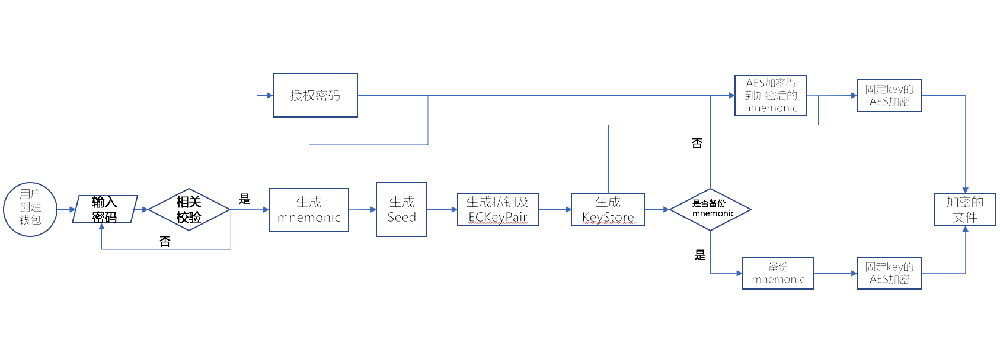
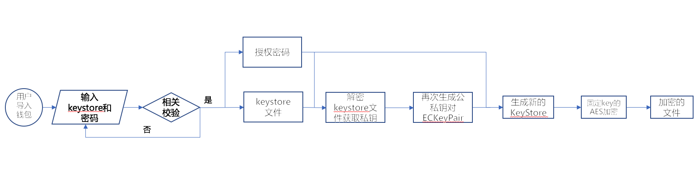
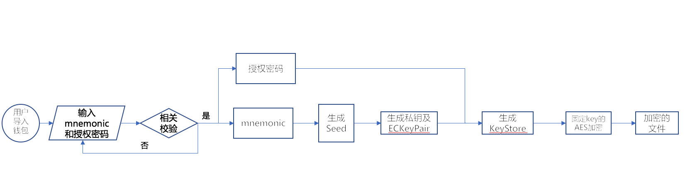
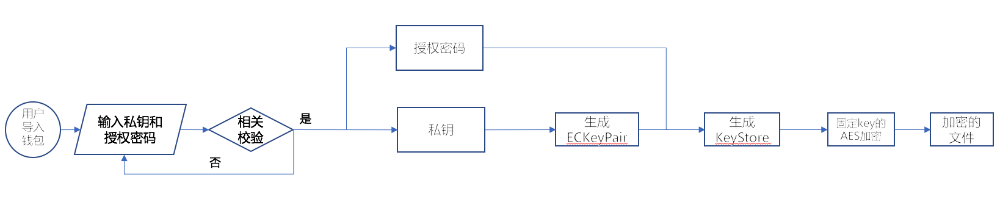

# iBitcome数字钱包app安全设计

## 阅读对象

包括iBitcome钱包的架构设计人员、开发人员、安全测试人员以及其他安全相关人员。

## 安全设计

iBitcome钱包的主要功能有一下几点：

- 创建钱包管理

  * 助记词的生成和管理
  * 私钥的生成和管理
  * 钱包地址的生成
- 备份钱包管理
  * 备份keystore文件
  * 备份私钥
  * 备份助记词

- 导入其他钱包管理
  
  * keystore文件导入
  * 私钥导入
  * 助记词导入

- 对数字资产进行转账（买入/卖出）等

结合加密数字钱包的业务场景和业界多款数字钱包的优秀实践以及APP通用安全，iBitcome钱包的设计应遵循以下安全体系：基础安全、密钥管理安全、业务安全、开发流程安全。

### 主要流程

去中心化钱包的核心功能包括密钥管理和加密数字货币交易，特么是密钥管理是重中之重。假如密钥管理设计不安全将会导致用户的资金损失。这里我们主要分析iBitcome钱包的密钥管理流程。

通过反编译iBitcome钱包android app，可以得到密钥管理的安全相关流程：

#### 新建钱包

创建钱包的主要流程如下图所示：

从上图可以看到，创建钱包主要有如下几步流程完成：

* step1:用户输入授权密码并且做密码复杂度校验，通过则进入step2反之继续step1；
* step2:随机生成长度为12的助记词；
* step3:使用step2生成的助记词生成随机种子Seed；
* step4:使用随机种子Seed字节数组的0-31字节作为私钥，并且同时生成公私钥对ECKeyPair；
* step5:使用step4生成的公私钥对ECKeyPair和step1输入的授权密码生成keystore文件；
* step6:判断是否需要备份助记词，需要进入step7，不需要进入step8；
* step7:引导用户备份助记词；
* step8:将step2生成的助记词使用step1的授权密码作为key，采用AES加密算法加密；
* step9:将step5生成的keystore文件和step8生成的加密的助记词加其他时间戳等信息，采用固定密钥的AES加密算法加密后存储。

#### 导入钱包

##### keystore文件导入

keystore文件导入钱包，需要输入keystore密码即创建钱包输入的授权密码。主要流程如下图所示：

从上图可以看到，keystore文件导入钱包主要有如下几步流程：

* step1:用户输入keystore文件和密码并且做keystore和密码校验，通过则进入step2反之继续step1；
* step2:使用step1输入的密码对输入的keystore文件进行加密恢复得到私钥；
* step3:使用step2恢复的私钥从新生成公私钥对ECKeyPair；
* step4:使用step3生成的公私钥对ECKeyPair和step1输入的密码从新生成keystore文件；
* step5:将step4生成的keystore文件加其他时间戳等信息，采用固定密钥的AES加密算法加密后存储。

##### 助记词导入

助记词导入钱包，需要输入新的授权密码。主要流程如下图所示：

从上图可以看到，助记词导入钱包主要有如下几步流程：

* step1:用户输入助记词和授权密码并且做助记词语法和密码复杂度校验，通过则进入step2反之继续step1；
* step2:使用step1输入的助记词生成随机种子Seed；
* step3:使用随机种子Seed字节数组的0-31字节作为私钥，并且同时生成公私钥对ECKeyPair；
* step4:使用step3生成的公私钥对ECKeyPair和step1输入的授权密码生成keystore文件；
* step5:将step4生成的keystore文件加其他时间戳等信息，采用固定密钥的AES加密算法加密后存储。

##### 私钥导入

私钥导入钱包，需要输入新的授权密码。主要流程如下图所示：

从上图可以看到，私钥导入钱包主要有如下几步流程：

* step1:用户输入私钥和授权密码并且做私钥和密码复杂度校验，通过则进入step2反之继续step1；
* step2:使用输入的私钥生成公私钥对ECKeyPair；
* step3:使用step2生成的公私钥对ECKeyPair和step1输入的授权密码生成keystore文件；
* step4:将step3生成的keystore文件加其他时间戳等信息，采用固定密钥的AES加密算法加密后存储。

### 基础安全

**注意：**
**对于iBitcome钱包来讲，本质上还是一个android和IOS的APP应用，APP通用基础的安全请遵循：**

- **[Android应用软件通用安全设计.md](../app/android/Android应用软件通用安全设计.md)**

- **[Android通用安全编程规范.md](../app/android/Android通用安全编程规范.md)**

- **[IOS应用软件通用安全设计.md](../app/IOS/IOS应用软件通用安全设计.md)**

- **[IOS通用安全编程规范.md](../app/IOS/IOS通用安全编程规范.md)**

#### 存储安全

在本地存储数据时，是否会将敏感信息保存在本地，如果一些对用户敏感的信息保存在本地，容易被攻击者进行逆向分析。

- 采用安全的加密算法例如AES，3DES等安全的对称加密算法加密本地保存的敏感数据，并且能够CBC模式的必须采用CBC模式，禁止ECB模式。
- 密钥和向量需要隐藏，不能硬编码在java或者objectiv-c中，因为这两种语言是比较容易被反编译的。
- 尽量把加解密算法写入到so库， 并且在编译so的时候对源码进行源码混淆来提高so文件反编译难度。
- 如果有可能，采用安全公司的密钥白盒SDK生成加解密密钥。

#### 网络安全

在数据网络交互通信中，如果采用http协议明文传输的方式，将会导致敏感信息被泄漏、中间人攻击，黑客将数据替换，导致用户在APP上收到虚假信息、链路被劫持等风险。

- 传输敏感信息必须使用https，并且对服务器端端证书和域名做严格的校验。
- 检测链路是否存在使用相关代理的情况。
- 重要敏感数据采用二次加密的方式，必须采用业务证明的安全的加密算法和妥善保存密钥。
- 通信协议加密SDK，可以通过对开发者预提交的https通信证书，进行校验和锁定，屏蔽各种第三方中间人注入工具（例如fiddler、burp等），防止https通信数据被拦截、窃听和修改，极大的保护了https通信中的协议安全。

#### 内存安全

钱包APP未对于手机环境进行root/越狱、模拟器检测，会导致APP运行在已root/越狱、模拟器的手机上，使得APP相关核心执行过程被逆向调试分析。

- 钱包APP需要做root/越狱、模拟器环境检查，如果检测到运行环境已经root/越狱、模拟器，APP提示用户并且强制退出。

钱包APP未对于手机当前系统版本进行检测并做出相关判断，将导致已知漏洞对手机系统的损害，使得钱包APP容易被黑客控制权限。

- 如果有必要做此项检测，需要使用安全公司的清场SDK来检测APP的运行环境是否安全。

钱包的账户管理（包括新建钱包、备份、导入钱包、存储钱包）属于钱包的核心算法，为了提高钱包的安全性采取如下措施。

- 核心算法的源代码采取源码混淆的方式来提高源码被反编译的难度。
- 整体采用加固技术来对抗钱包app被反编译。

#### 安装包安全

钱包APP未做完整性检测，会导致黑客可以对APP重新打包植入恶意代码，窃取用户助记词，私钥等敏感信息，我们将进行模拟攻击，对APP进行重打包，修改验证机制来判定是否可利用此漏洞。

- APP对自身代码做完整性校验，并且采用安全的签名打包机制。android必须采用APK签名方案v2，IOS采用苹果官方的正常签名流程即可。

### 密钥管理安全

去中心化的加密数字货币钱包的一个重要特征就是用户能够自行管理私钥，一旦用户的私钥被泄漏将会导致用户的资金管理遭受到最严重的损失，因此密钥管理是整个加密数字货币钱包的核心。

iBitcome钱包的密钥管理必须遵循以下安全设计：

#### 助记词生成与存储的安全 

##### 助记词创建安全

新用户使用钱包APP时，会生成助记词要求用户记录，此过程是否有检测截屏，录屏等操作，如未进行安全检测，将会导致钱包核心敏感信息泄露，用户钱财损失。

- 助记词长度为12-24，一般采用12。
- 助记词产生的随机数必须采用安全随机数，例如使用java的SecureRandom而不是Random。
- iBitcome钱包采用开源库novacrypto.github.io的io.github.novacrypto.bip39.MnemonicGenerator生成助记词。
- 涉及助记词页面必须有防止界面被截屏或者录屏的措施。
- 禁止任何私自记录助记词的行为，包括log日志、临时文件等。

##### 助记词存储安全

助记词生成后，如果会在本地保存，在本地保存时是明文存储，将会导致黑客进行攻击获取用户助记词信息。如果是加密存储，加密算法安全性不高，将会导致黑客可以逆向分析算法，将加密数据进行恢复明文，导致用户助记词信息泄露。

- 原则上iBitcome钱包app禁止本地以任何形式存储助记词。
- 在用户没有备份助记词之前：

  * 需要提醒用户及时备份助记词。
  * 助记词持久性的加密存储在iBitcome钱包app本地。加密算法采用业界安全的对称加密算法例如AES、3DES等，加密模式采用CBC模式。
  * 加解密密钥使用用户创建钱包时候的输入的授权密码。
  * 整个加密算法最好写入到so库，因为so库在混淆编译后反编译的难度大于java代码的反编译难度。

- 用户备份助记词之前需要校验授权密码，在用户备份助记词以后，iBitcome钱包本地必须删除助记词的相关所有信息。

#### 私钥生成与存储的安全

##### 私钥生成、导出安全

钱包APP在新用户私钥生成过程，相关算法如果可被逆向分析，会导致黑客模拟生成的私钥，使用户的钱财受到损失。

- 采用开源库novacrypto.github.io的io.github.novacrypto.bip39.SeedCalculator使用助记词生成Seed种子。
- 采用SeedCalculator使用助记词生成Seed种子字节数组的0-31字节作为私钥。
- 采用开源库quincysx.crypto利用助记词作为输入生成的Seed生成公私钥对ECKeyPair。
- quincysx.crypto采用secp256k1椭圆曲线作为椭圆曲线算法的输入生成ECKeyPair。
- 私钥长度满足相关协议要求规定，iBitcome钱包私钥长度为256位。
- 私钥导出功能必须验证授权口令，且导出界面必须有防止界面截屏和录屏功能。
- 禁止任何私自记录私钥的行为，包括log日志、临时文件等。

##### 私钥储存安全

私钥生成后，如果会在本地保存，在本地保存时是明文存储，将会导致黑客进行攻击获取用户私钥信息。如果是加密存储，加密算法安全性不高，将会导致黑客可以逆向分析算法，将加密数据进行恢复明文，导致用户私钥信息泄露。

- 掌握了私钥，就相当于掌握了用户的钱包。因此iBitcome钱包app本地禁止以任何形式存储用户的私钥（keystore文件除外）。

#### Keystore生成与存储的安全

##### keystore生成、导出安全

keystore文件的生成过程，相关算法是否可以被逆向分析。

- 使用quincysx.crypto生成的Keypair和授权密码作为输入，采用开源库quincysx.crypto生成keystore文件。
- keystore备份文件导出的界面必须有防止界面截屏和录屏措施。
- 禁止任何私自记录keystore文件的行为，包括log日志、临时文件等。

##### keystore存储安全

keystore文件存储在本地，在本地保存时是明文存储，将会导致黑客进行攻击获取用户私钥信息。如果是加密存储，加密算法安全性不高，将会导致黑客恶意破解加密数据。如果keystore文件存储在公共存储区域，将会导致被恶意app删除keystore文件文件。

- keystore文件本地加密存储，具体的存储方式请参考[存储安全](#存储安全)章节。
- keystore文件存储在私有沙箱目录下，例如每个APP特有的/data/data/com.winway.ibitcome/目录下。不要存储到公共的存储区域例如外部storage目录，因为只要其他恶意的app申请了storage的权限就可以对存储在此目录下的keystore文件做操作。

#### 钱包授权密码生成、修改与存储的安全

##### 钱包授权密码生成、修改安全

交易密码如果未检测弱口令，将会导致黑客对密码进行猜解，直接进行交易。修改口令之前没有验证旧口令，将会导致口令被恶意修改。

- 在输入口令的时候必须检测口令是否符合相关密码复杂度要求。例如是否满足一定的长度和数字、大小写字母、特殊符号组成。
- 输入口令页面必须有防止界面截屏和录屏功能。
- 禁止任何私自记录口令的行为，包括log日志、临时文件等。
- 修改旧口令之前必须验证新口令，如果验证失败必须回退到业务初始状态。

##### 钱包授权密码存储安全

iBitcome钱包授权密码本地存储，本地储存加密不严格，则会导致黑客对其进行逆向分析，获取到钱包授权密码。

- iBitcome钱包禁止app以任何形式存储钱包授权密码， 并且在创建钱包时提醒用户妥善保存钱包授权密码。 

#### 导入钱包安全

导入钱包目前三种方式：

##### keystore文件+授权密码

通过导入keystore文件和授权密码方式来导入钱包，需要注意的是：

- 在这个过程中任何文件例如包括log日志、临时文件等记录授权密码和私钥。
- 导入的keystore文件的保存安全措施和新建钱包一样，参考[Keystore生成与存储的安全](#Keystore生成与存储的安全)

##### 助记词+新的授权密码

通过助记词和新的授权密码来导入钱包，内部实现的流程和新建钱包流程类似，需要注意的是：

- 在这个过程中任何文件例如包括log日志、临时文件等记录授权密码和助记词。
- 通过这种方式生成的keystore文件的存储安全措施和新建钱包一样，参考[Keystore生成与存储的安全](#Keystore生成与存储的安全)

##### 私钥+新的授权密码

通过私钥和新的授权密码来导入钱包，内部实现的流程和新建钱包流程类似，需要注意的是：

- 在这个过程中任何文件例如包括log日志、临时文件等记录授权密码和私钥。
- 通过这种方式生成的keystore文件的存储安全措施和新建钱包一样，参考[Keystore生成与存储的安全](#Keystore生成与存储的安全)

### 业务安全

#### 创建交易安全

在用户创建交易时，交易双方的账号如果没有二次验证，则容易导致收款账户信息被恶意替换后无法知道，导致用户钱财损失问题。

- 填写交易信息后，在发送交易之前需要有最终确认的过程来保证交易双方地址和金额是否正确。
- 交易失败后，需要回滚到交易之前到初始状态。

#### 交易签名安全

在交易创建后，发送正式签名交易过程，如果相关协议设计不严格，会导致用户财产受到损失。

- 严格按照相关协议要求设计交易签名信息和其他信息。

#### 交易完毕确认

交易完毕后，如果未对交易内容进行确认，会导致使用户清晰了解此次交易过程的记录，在APP上无法记录相关信息，无法查询个人交易记录，我们会对此过程进行分析。

- 必须提供交易完成确认功能。

#### 余额查询安全

钱包APP在进行余额查询时，无论是从货币官方服务器，还是钱包厂商服务器进行的查询，应严格对其返回给客户端的数据进行完整性验证，否则容意导致用户APP数据接收虚假、异常信息。

### 开发流程安全

#### 代码安全

- 数字钱包APP代码上线前进行进行安全审核，检查通过后，允许上线。每次改动代码后，也要进行安全复查，同时定期进行黑灰盒扫描测试。另外对代码进行严格控制，防止上传到Github等第三方代码托管平台。
