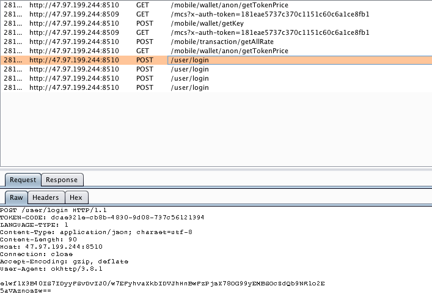
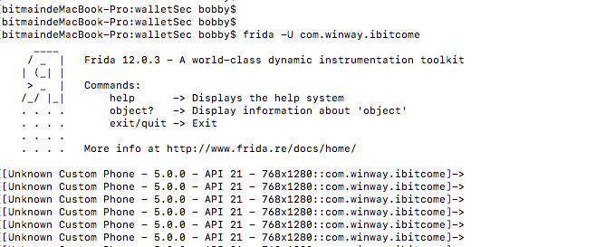
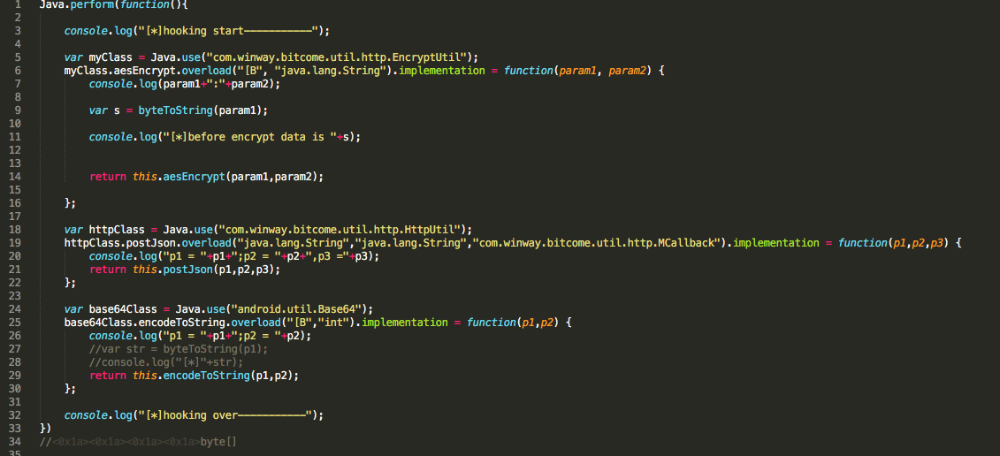
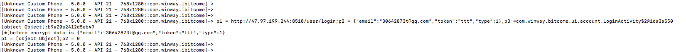
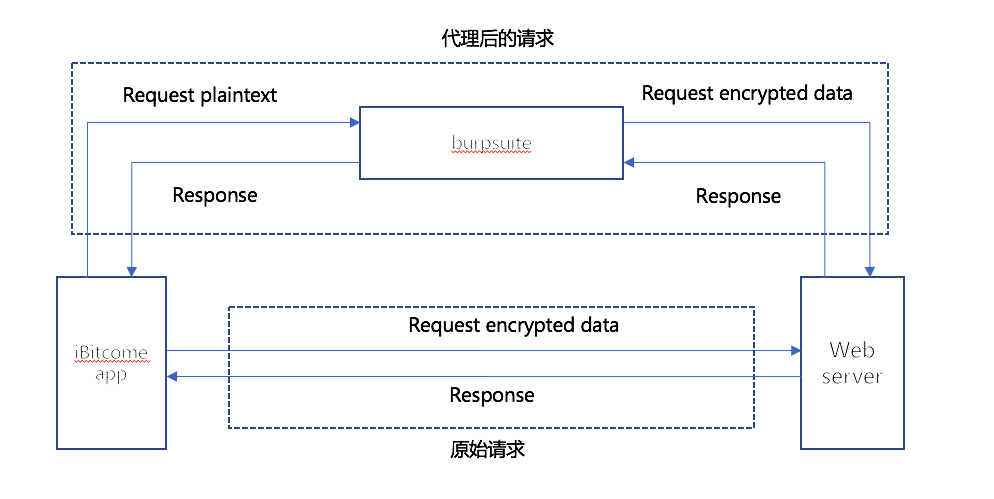
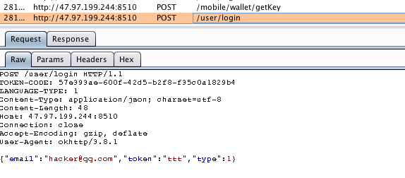
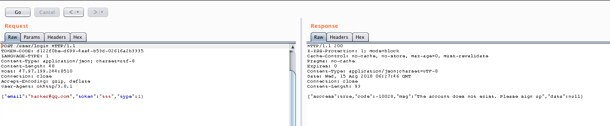

# iBitcome钱包加密流量破解分析


## 前言

我们在做app的渗透测试的时候，需要测试app后台服务器端的漏洞例如注入、越权、逻辑漏洞等。往往这个时候的通用做法都是使用代理工具（burpsuite、fiddler之类）做http or https流量代理，然后在拦截的流量上面通过修改http报文的方式来做渗透测试。

但是现在越来越多的app和后台的通信不仅仅是采用了https，还采用了数据二次加密的方式进行通信。这个时候我们通过代理工具拦截到的http报文，可以看到整个content boby是加密后的密文，无法直接修改http报文的content boby。同是app采用了https，客户端也做了https的服务器端的证书校验，这个时候使用代理将会导致ssl链路链接失败。

那么遇到上面所说的两种情况，我们该如何去破解二次加密后的流量来为继续做渗透测试打下基础的呢，下面我们以iBitcome的android版本1.3.0.24为例子做详细的分析。

## 详细分析

首先启动android版本4.4的模拟器，在模拟器上面安装好iBitcome，并且在电脑上面配置好adb环境。

>这里为什么需要是4.4版本的android模拟器，是因为iBitcome的minSdkVersion="19"，并且这里破解二次加密流量需要使用的xposed框架。而xposed在android5.0上面安装比较复杂，所以android版本的选择也很重要。

### 配置流量代理环境

>这个环境能够配置成都的前提是如果使用手机做测试，需要保证手机和启动http代理工具的burpsuite在一个wifi环境内。这里为使用的是模拟器，那么肯定和代理工具在一个wifi环境以内。

具体的怎么让手机http流量走代理工具burpsuite，后续会有详细的文档介绍。

### 破解二次加密流量

#### 收集信息

打开iBitcome，旧版本的有一个登陆功能。我们点击登陆然后在burpsuite上看到登陆请求的流量是加密了的：



从上面的截图我们可以看到，有一个post请求是：

```
POST /mobile/wallet/getKey HTTP/1.1
Content-Type: multipart/form-data; boundary=751bc34a-4462-461d-8c98-659eb84d2150
Content-Length: 152
Host: 47.97.199.244:8510
Connection: close
Accept-Encoding: gzip, deflate
User-Agent: okhttp/3.8.1

--751bc34a-4462-461d-8c98-659eb84d2150
Content-Disposition: form-data; name="eth"
Content-Length: 3

eth
--751bc34a-4462-461d-8c98-659eb84d2150--
```
响应是：

```
HTTP/1.1 200 
X-XSS-Protection: 1; mode=block
Cache-Control: no-cache, no-store, max-age=0, must-revalidate
Pragma: no-cache
Expires: 0
TOKEN-CODE: dcae321e-cb8b-4830-9d08-737c56121394
Content-Type: application/json;charset=UTF-8
Date: Wed, 15 Aug 2018 02:36:50 GMT
Connection: close
Content-Length: 60

{"success":true,"code":1,"msg":"","data":"af6febacc1fd79aa"}
```
通过抓取报文可以看到每次从新打开app的时候必定会发送此请求到服务器端，然后服务器端会反馈回来一个长度为16的字符串。或者在间隔一段时间后我们在发送http的请求的时候，app也会发出这个请求去获取一个字符串。通过分析iBitcome的源码不难分析出其实这个就是http流量做二次加密的密钥。iBitcome app代码里面有一个超时机制判断，只要这个获取的key大于一定的时间戳就会发送请求到服务器端申请新的key。

**当然这个也是一种安全机制，初级的实现了动态密钥，对需要破解此二次加密流量提升了一定的难度。**

当然这里我们看到login登陆请求的content body是一串加密后的字符串：
```
POST /user/login HTTP/1.1
TOKEN-CODE: dcae321e-cb8b-4830-9d08-737c56121394
LANGUAGE-TYPE: 1
Content-Type: application/json; charset=utf-8
Content-Length: 90
Host: 47.97.199.244:8510
Connection: close
Accept-Encoding: gzip, deflate
User-Agent: okhttp/3.8.1

e1wf1X3B40IS7IDyyFSvDvIJ0/w7EFyhvaXkbIDVJhHnBwFzPjsX78OG99yEMBSOcZdQb9NR1o2E
5aVAznosZw==
```
如果我们需要在这里对登陆请求做SQL注入的渗透测试，那么第一步必须需要破解这里的流量二次加密，即是本文档这次需要讲解的重点。

##### 反编译iBitcome获取加密信息

现在我们开始寻找iBitcome对此流量的加密的地方。这里需要对android开发和反编译有一定的基础知识，不然会找不到地方。

这里根据经验我们是在测试登陆请求，那么直接在manifest的xml文件里面查看是否存在Login之类的Activity，还好立马看到了在xml文件里面看到了
```
com.winway.bitcome.ui.account.LoginActivity
```
(why?前面讲过我们需要熟悉android的开发以及开发人员的习惯，一般来讲每个动作都是以动作的英文名命名)

在这个类里面有一个login方法：

```
private void login(LoginReq arg3) {
    this.showLoadingDialog();
    HttpUtil.postJson("http://47.97.199.244:8510/user/login", r.a(arg3), new MCallback() {
        public void onResponse(ResponseDto arg3, String arg4) {
            LoginActivity.this.hideLoadingDialog();
            if(arg3.code == 1) {
                Object v3 = r.a(arg4, UserDto.class);
                ((UserDto)v3).isLogin = true;
                AccountManager.get().setUser(((UserDto)v3));
                LoginActivity.this.setResult(-1);
                MApp.getApplication().toMain(LoginActivity.this);
            }
            else {
                LoginActivity.this.showToast(arg3.msg);
            }
        }
    });
}
```
ok，对照url基本上我们就可以确定这里就是处理登陆请求的地方。根据这个函数我们就可以一步步的跟踪下去

login(LoginReq arg3)->postJson(String arg1, String arg2, MCallback arg3) ->postJson(String arg6, u arg7, String arg8, MCallback arg9)

```
    public static void postJson(String arg1, String arg2, MCallback arg3) {
        HttpUtil.postJson(arg1, HttpUtil.TYPE_JSON, arg2, arg3);
    }

    public static void postJson(String arg6, u arg7, String arg8, MCallback arg9) {
        if(!t.a(MApp.getApplication())) {
            ResponseDto v6 = new ResponseDto();
            v6.code = -200;
            v6.msg = MApp.getApplication().getApplicationContext().getString(2131624102);
            arg9.onResponse(v6, "");
            return;
        }

        if(!TextUtils.isEmpty(HttpUtil.mPrivate)) {
            if(System.currentTimeMillis() - HttpUtil.mPrivateTime > 1800000) {
            }
            else if(TextUtils.isEmpty(HttpUtil.mPrivate)) {
                return;
            }
            else {
                c.b("request", arg6);
                c.b("request", "private:" + HttpUtil.mPrivate + "\n" + String.format("%s", arg8));
                a v7 = new a().b("TOKEN-CODE", d.b(MApp.getApplication(), "TOKEN-CODE", "")).b("LANGUAGE-TYPE", HttpUtil.getLanguage()).a(arg6).a(aa.a(arg7, Base64.encodeToString(EncryptUtil.aesEncrypt(arg8.getBytes(), HttpUtil.mPrivate), 0)));
                Object v8 = d.b(MApp.getAppContext(), "session", "");
                if(!TextUtils.isEmpty(((CharSequence)v8))) {
                    v7.b("x-auth-token", ((String)v8));
                }

                e v7_1 = HttpUtil.instance().getHttp().a(v7.b());
                v7_1.a(((f)arg9));
                HttpUtil.putCall(arg6, v7_1);
                return;
            }
        }

        HttpUtil.getPrivate(arg6, arg8, arg9);
    }

```

从上面代码段我们可以看到这里有一个判断app获取的mprivite的时间戳等对比，超过一定的时间就会去从新获取这个key。间接印证了前行根据流量的分析。

可能大家已经看到postJson方法里面有一段代码是

```
 a v7 = new a().b("TOKEN-CODE", d.b(MApp.getApplication(), "TOKEN-CODE", "")).b("LANGUAGE-TYPE", HttpUtil.getLanguage()).a(arg6).a(aa.a(arg7, Base64.encodeToString(EncryptUtil.aesEncrypt(arg8.getBytes(), HttpUtil.mPrivate), 0)));
```
这里的arg8即是前面传过来的LoginReq转换后的对象，有经验的同学基本就可以看出这里明显是对传入的参数做aes加密后使用base64转换为字符串后再传输到服务器端，当然这里的mprivate即为前面分析的从服务器端获取的key。

其实如果我们需要去分析EncryptUtil.aesEncrypt函数，即可看到：

```
public static byte[] aesEncrypt(byte[] arg3, String arg4) {
    try {
        SecretKeySpec v0 = new SecretKeySpec(arg4.getBytes(), "AES");
        IvParameterSpec v1 = new IvParameterSpec("rst@123456--java".getBytes());
        Cipher v4 = Cipher.getInstance("AES/CBC/PKCS5Padding");
        v4.init(1, ((Key)v0), ((AlgorithmParameterSpec)v1));
        return v4.doFinal(arg3);
    }
    catch(Exception v3) {
        v3.printStackTrace();
        return null;
    }
}
```
从上面代码我们可以看到加密算法模式采用的是AES/CBC/PKCS5Padding，这里的iv向量是硬编码的rst@123456--java，密钥是外部输入即服务器端获取的密钥。

好了，分析到这一步，我们需要印证一下我们分析到代码流程是否正确。重点来了，我们怎么确定我们分析的代码流程是否正确的呢，这个时候就需要移动应用渗透必备hook神器frida或者是xposed了。

对于xposed的简单介绍和使用[请参考](http://repo.xposed.info/)

对于frida的简单介绍和使用[请参考](https://frida.re/)

这里对两个工具的使用就不详细介绍，后续会有详细的文档介绍。

因为我自己比较喜欢使用frida，因为它更加方便而不会像xposed每次修改代码后都需要从新打包重启，所以这里我使用的是frida这个hook框架。在配置好frida的环境以后，在shell终端里面使用命令frida -U com.winway.ibitcome，如果出现如下图所示，说明frida已经正确的hook了iBitcome了。



现在我们开始编写js脚本来验证我们前面的代码分析流程是否正确，编写好的js脚本如下：



如上图所示的代码，我们这里hook了三个重要的函数postJson、aesEncrypt、encodeToString并且把入参打印出来，然后我们在iBitcome登陆页面输入账号和密码然后点击登陆，在shell终端可以看到：



从shell终端可以看到打印出来了几个函数的入参，我们可以看到aesEncrypt第一个入参从字节数组还原成字符串以后为：

```
{"email":"30642873t@qq.com","token":"ttt","type":1}
```
这里正是我们输入的账户和密码。

好了，讲到这里可以看到我们已经成功分析出加解密流程和使用hook框架成功hook住加密函数。那么问题来了，前面我们讲到我们如果需要做渗透测试查看email和token参数服务器端在处理的时候是否存在SQL注入，我们需要把流量引到burpsuite去修改email和token的值。那么我们这个时候需要怎么做呢。

这里用一张图阐述这个思路：



- step1：我们让iBitcome的http流量都代理发送到burpsuite；
- step2：强制让iBitcome app都发送明文，即是让加密函数aesEncrypt返回到仍然是原始的未加密的信息；
- step3：在代理工具burpsuite上面写一个加解密插件，将发送过来的明文转换为秘文然后发送到服务器端。

这里我们就可以在burpsuite上修改报文来测试email和token参数是否存在SQL注入了。当然这里我们如果需要用sqlmap工具来自动化分析是否存在sql注入，可以在使用sqlmap的时候使用 --proxy="http://127.0.0.1:8088" 的方式强制让sqlmap的流量都发送到burpsuite上面，然后burpsuite的插件在加密content body后发送到服务器端，这样服务器端就可以正常解析秘文了。

这里hook框架frida的js脚本如下：

```

Java.perform(function(){ 

	console.log("[*]hooking start-----------");

	var myClass = Java.use("com.winway.bitcome.util.http.EncryptUtil"); 

	myClass.aesEncrypt.overload("[B", "java.lang.String").implementation = function(param1, param2) {  

		console.log("[*]before encrypt data is "+byteToString(param1));

		return param1;
		
	};
	
	
	var base64Class = Java.use("android.util.Base64");
	
	base64Class.encodeToString.overload("[B","int").implementation = function(p1,p2) {  
		
		var str = byteToString(p1);
		
		console.log("[*]"+str);

		return str;
		
	};
    
    console.log("[*]hooking over-----------");
})
//byte[] 


function stringToByte(str) {
	var bytes = new Array();
	var len, c;
	len = str.length;
	for(var i = 0; i < len; i++) {
		c = str.charCodeAt(i);
		if(c >= 0x010000 && c <= 0x10FFFF) {
			bytes.push(((c >> 18) & 0x07) | 0xF0);
			bytes.push(((c >> 12) & 0x3F) | 0x80);
			bytes.push(((c >> 6) & 0x3F) | 0x80);
			bytes.push((c & 0x3F) | 0x80);
		} else if(c >= 0x000800 && c <= 0x00FFFF) {
			bytes.push(((c >> 12) & 0x0F) | 0xE0);
			bytes.push(((c >> 6) & 0x3F) | 0x80);
			bytes.push((c & 0x3F) | 0x80);
		} else if(c >= 0x000080 && c <= 0x0007FF) {
			bytes.push(((c >> 6) & 0x1F) | 0xC0);
			bytes.push((c & 0x3F) | 0x80);
		} else {
			bytes.push(c & 0xFF);
		}
	}
	return bytes;
}
//byte[]
function byteToString(arr) {
	if(typeof arr === 'string') {
		return arr;
	}
	var str = '',
		_arr = arr;
	for(var i = 0; i < _arr.length; i++) {
		var one = _arr[i].toString(2),
			v = one.match(/^1+?(?=0)/);
		if(v && one.length == 8) {
			var bytesLength = v[0].length;
			var store = _arr[i].toString(2).slice(7 - bytesLength);
			for(var st = 1; st < bytesLength; st++) {
				store += _arr[st + i].toString(2).slice(2);
			}
			str += String.fromCharCode(parseInt(store, 2));
			i += bytesLength - 1;
		} else {
			str += String.fromCharCode(_arr[i]);
		}
	}
	return str;
}

```
从下图可以看到，iBitcome发送到burpsuite的已经是明文content body了：


但是从burp上看到服务器端返回来的是Unable to resolve request content，正常！因为服务器端接受到的是明文信息，肯定不能正确的解密，因此这个时候我们需要在burp上面写一个插件了。插件的主要代码如下：

```

public class BurpExtender implements IBurpExtender,IHttpListener{
	public PrintWriter stdout;
	public IExtensionHelpers helper;
	public IBurpExtenderCallbacks callbacks;
	private boolean flag = false;
	private String key = null;
	@Override
	public void registerExtenderCallbacks(IBurpExtenderCallbacks callbacks) {
		// TODO Auto-generated method stub
		this.callbacks = callbacks;
		this.stdout = new PrintWriter(callbacks.getStdout(), true);
		this.helper = callbacks.getHelpers();
		callbacks.setExtensionName("BitcomeExtender");
		callbacks.registerHttpListener(this);
		stdout.println("loading extender successful");
		
		
	}

	@Override
	public void processHttpMessage(int toolFlag, boolean messageIsRequest, IHttpRequestResponse messageInfo) {
		// TODO Auto-generated method stub
		if(messageIsRequest)
		{
			String string = helper.bytesToString(messageInfo.getRequest());
			if(string.contains("/mobile/wallet/getKey"))
			{
				flag = true;
			}else
			{
				int offset = helper.analyzeRequest(messageInfo.getRequest()).getBodyOffset();
				String reqBody = string.substring(offset);	
				stdout.println("----------------------"+reqBody);	
				stdout.println("----------------------getKey = "+key);
				if(key!=null)
				{
					byte[] array = CryptUtil.aesEncrypt(reqBody.getBytes(), key);
					String cipherText = new String(Base64.getEncoder().encode(array));
					stdout.println("----------------------\r\n"+cipherText);
					IRequestInfo analyzeRequest= helper.analyzeRequest(messageInfo); 
					List<String> headers= analyzeRequest.getHeaders();
//					IParameter newPara= helper.buildParameter(name, value, type)
//					helper.updateParameter(requestbyte,newPara);
					helper.buildHttpMessage(headers, cipherText.getBytes());
					messageInfo.setRequest(helper.buildHttpMessage(headers, cipherText.getBytes()));
				}
			}
		}else
		{
			if(flag)
			{
				String content = helper.bytesToString(messageInfo.getResponse());
//				stdout.println(content);
				String body = content.substring(helper.analyzeResponse(messageInfo.getResponse()).getBodyOffset());
				key = getKey(body);
				stdout.println("----------------------key = "+key);
				flag = false;
			}
		}	
	}
	public String getKey(String string)
	{
		String key = "";
		String pattern = "\"data\":\".*?\"";
		Pattern patt = Pattern.compile(pattern);
    	Matcher mathcher = patt.matcher(string);
    	if(mathcher.find()){
    		key = mathcher.group();
    		key = key.substring(8,24);
    	}
		return key;
	}
}

```

上面这段代码主要有下面几个功能：

- 拦截到url为/mobile/wallet/getKey，说明这里是iBitcome在从服务器端获取加解密密钥，因此拦截response报文获取到密钥为key。
- 拦截到iBitcome发送到明文信息，并且用iBitcome的加解密算法加密后从新发送到服务器端。

在为burp写好插件并且编译安装好以后，我们来看实际的运行效果：



从上图所示我们可以看到虽然app提交的是明文，但是服务器端已经正确解析，不会提示无法解析content了。

好了到这里我们就可以在burp上面做对服务器端的安全渗透测试了。

>**当然这里如果我们碰到响应也是加密的情况下，我们完全可以在burpsuite的插件上面添加一段代码来解密服务器端的response，因此这里使用了AES对称加密算法，加解密的密钥肯定都是一样的并且都是从服务器端下发下来，burp也拦截到了的，这样就不再做详细的介绍。**

## 总结

从上面的实际操作来看，我们需要破解加密后的流量还是比较容易的。并且我们可以用类似的方法破解报文的签名信息等其他操作。

>**iBitcome的IOS版本的二次加密数据破解也是使用这个类似的方法进行操作。**

当然，我们如果需要减轻这种攻击方式，我们可以用一下几点：

- 密钥和加密方式更加复杂来对抗破解；
- 加解密等核心算法使用JNI的方式，因为现在的hook框架主要还是针对java层的；
- 对app的源代码混淆，毕竟混淆后的代码分析起来难度会更大；
- 如果有需要采用app整体加固的方式，因为如果都反编译得不到源代码，也就无法分析代码从而进行hook。
- 对于https的方式，app一定要校验服务器端的证书，如果iBitcome做了证书校验，那么本次攻击起来难度又会更复杂一点。


